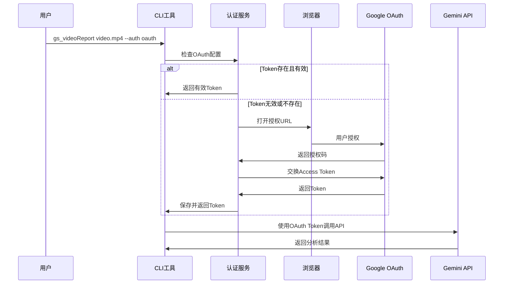

# OAuth 2.0 集成说明

## 概述

gs_videoReport 支持通过 OAuth 2.0 认证访问需要特殊权限的 Google API 功能，特别是访问私有 YouTube 视频的能力。本文档详细说明了 OAuth 集成的实现、配置和使用方法。

## 架构设计

### 认证方式优先级

系统支持多种认证方式，按以下优先级顺序：

1. **CLI 参数** - `--api-key` 参数
2. **环境变量** - `GOOGLE_GEMINI_API_KEY`
3. **配置文件** - `config.yaml` 中的设置

### OAuth 工作流程



## 配置设置

### config.yaml 配置

```yaml
# 基础API密钥（用于公开API调用）
api_key: "your-gemini-api-key"
model_name: "gemini-2.5-flash"
default_output_path: "./outputs/"
default_prompt_template: "comprehensive_lesson"

# 认证类型设置
auth_type: "api_key"  # 或 "oauth"

# OAuth 2.0 配置（访问私有内容时使用）
oauth:
  client_id: "your-google-oauth-client-id"
  client_secret: "your-google-oauth-client-secret"
  # 以下字段由系统自动管理
  # access_token: "auto-managed"
  # refresh_token: "auto-managed"
  # token_expiry: "auto-managed"
```

### 环境变量设置

```bash
# API Key 认证
export GOOGLE_GEMINI_API_KEY="your-api-key"

# OAuth 客户端信息
export GOOGLE_OAUTH_CLIENT_ID="your-client-id"
export GOOGLE_OAUTH_CLIENT_SECRET="your-client-secret"
```

## Google Cloud Console 配置

### 1. 创建 OAuth 2.0 客户端 ID

1. 访问 [Google Cloud Console](https://console.cloud.google.com/)
2. 选择或创建项目
3. 启用以下 API：
   - Google Gemini API
   - YouTube Data API v3 (如需访问 YouTube 私有视频)
4. 创建凭据 > OAuth 2.0 客户端 ID
5. 应用类型选择："桌面应用程序"
6. 下载客户端配置

### 2. 配置 OAuth 同意屏幕

1. 设置 OAuth 同意屏幕
2. 用户类型选择"外部"（测试阶段）
3. 填写应用信息：
   - 应用名称：gs_videoReport
   - 用户支持电子邮件
   - 开发者联系信息
4. 添加所需的 OAuth 范围（scopes）

### 3. 必需的 OAuth 范围

```
https://www.googleapis.com/auth/generative-language.retriever
https://www.googleapis.com/auth/youtube.readonly  # 如需访问私有YouTube视频
```

## 使用方法

### 基本用法

```bash
# 使用 API Key 认证（默认）
gs_videoReport video.mp4

# 显式指定 OAuth 认证
gs_videoReport video.mp4 --auth oauth

# 首次OAuth认证时，系统会：
# 1. 打开浏览器进行授权
# 2. 保存Token到配置文件
# 3. 继续执行视频分析
```

### 高级用法

```bash
# 重新进行OAuth授权（清除现有Token）
gs_videoReport video.mp4 --auth oauth --reauth

# 使用特定的OAuth配置文件
gs_videoReport video.mp4 --config custom_oauth_config.yaml

# 查看当前认证状态
gs_videoReport --auth-status
```

## 实现细节

### 核心类和方法

#### `AuthConfig` 数据模型

```python
@dataclass
class OAuthConfig:
    client_id: str
    client_secret: str
    access_token: Optional[str] = None
    refresh_token: Optional[str] = None
    token_expiry: Optional[datetime] = None

@dataclass  
class AuthConfig:
    auth_type: AuthType
    api_key_config: Optional[ApiKeyConfig] = None
    oauth_config: Optional[OAuthConfig] = None
```

#### `AuthService` 服务层

```python
class AuthService:
    def __init__(self, config: Configuration):
        self.config = config
        
    def get_auth_config(self) -> types.AuthConfig:
        """根据配置返回适当的认证配置"""
        if self.config.auth_type == AuthType.OAUTH:
            return self._get_oauth_config()
        else:
            return self._get_api_key_config()
    
    def _get_oauth_config(self) -> types.AuthConfig:
        """处理OAuth认证配置"""
        oauth_config = self.config.oauth_config
        
        # 检查Token是否有效
        if self._is_token_valid(oauth_config.access_token):
            return types.AuthConfig(
                auth_type=types.AuthType.OAUTH,
                oauth_config=types.AuthConfigOauthConfig(
                    access_token=oauth_config.access_token
                )
            )
        
        # Token无效，需要刷新或重新授权
        return self._refresh_or_reauthorize(oauth_config)
```

#### `GeminiService` 集成

```python
class GeminiService:
    def __init__(self, auth_config: types.AuthConfig):
        self.client = genai.Client(auth_config=auth_config)
        
    def analyze_video(self, video_path: str, prompt: str) -> str:
        """使用配置的认证方式分析视频"""
        # 上传视频文件
        file = self.client.files.upload(file=video_path)
        
        # 调用分析API
        response = self.client.models.generate_content(
            model='gemini-2.5-flash',
            contents=[prompt, file]
        )
        
        return response.text
```

## 安全考虑

### Token 存储

- **位置**：Token 存储在 `config.yaml` 文件中
- **权限**：文件权限设置为 600 (仅所有者可读写)
- **版本控制**：`config.yaml` 必须在 `.gitignore` 中

### Token 刷新

- **自动刷新**：系统自动检测 Token 过期并刷新
- **失败处理**：刷新失败时引导用户重新授权
- **过期策略**：Token 过期前 5 分钟开始刷新

### 权限最小化

- **Scope 限制**：仅请求必要的 OAuth 范围
- **时效限制**：Token 设置合理的过期时间
- **访问控制**：验证 API 调用的授权范围

## 错误处理

### 常见错误和解决方案

1. **OAuth客户端ID无效**
   ```
   错误: Invalid OAuth client ID
   解决: 检查 Google Cloud Console 中的客户端ID配置
   ```

2. **Token过期**
   ```
   错误: OAuth token has expired
   解决: 系统自动刷新，如失败则重新授权
   ```

3. **权限不足**
   ```
   错误: Insufficient OAuth scope
   解决: 重新配置 OAuth 同意屏幕，添加必要的范围
   ```

4. **网络连接问题**
   ```
   错误: Failed to connect to OAuth server
   解决: 检查网络连接，确保能访问 googleapis.com
   ```

## 测试和调试

### 测试OAuth流程

```bash
# 测试OAuth配置
gs_videoReport --test-oauth

# 验证Token有效性
gs_videoReport --validate-token

# 查看详细的OAuth调试信息
gs_videoReport video.mp4 --auth oauth --verbose
```

### 调试信息

启用详细日志记录以调试OAuth问题：

```python
import logging
logging.basicConfig(level=logging.DEBUG)

# 系统将输出详细的OAuth流程信息
```

## 限制和注意事项

1. **测试用户限制**：未发布的应用最多支持100个测试用户
2. **Token生命周期**：Access Token 通常1小时过期，Refresh Token 可长期有效
3. **网络要求**：OAuth流程需要稳定的网络连接
4. **浏览器依赖**：首次授权需要浏览器支持

## 未来增强

1. **企业级部署**：支持服务账号认证
2. **批量授权**：支持多用户批量OAuth配置
3. **Token缓存优化**：改进Token存储和管理机制
4. **安全增强**：添加Token加密存储功能

---

**注意**: OAuth 2.0 集成是为了支持访问私有内容而设计的高级功能。对于大多数用例，使用标准的 API Key 认证即可满足需求。
