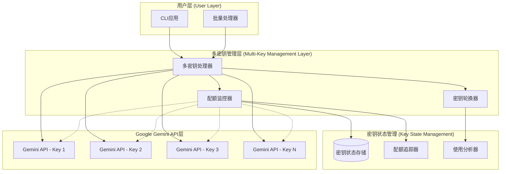
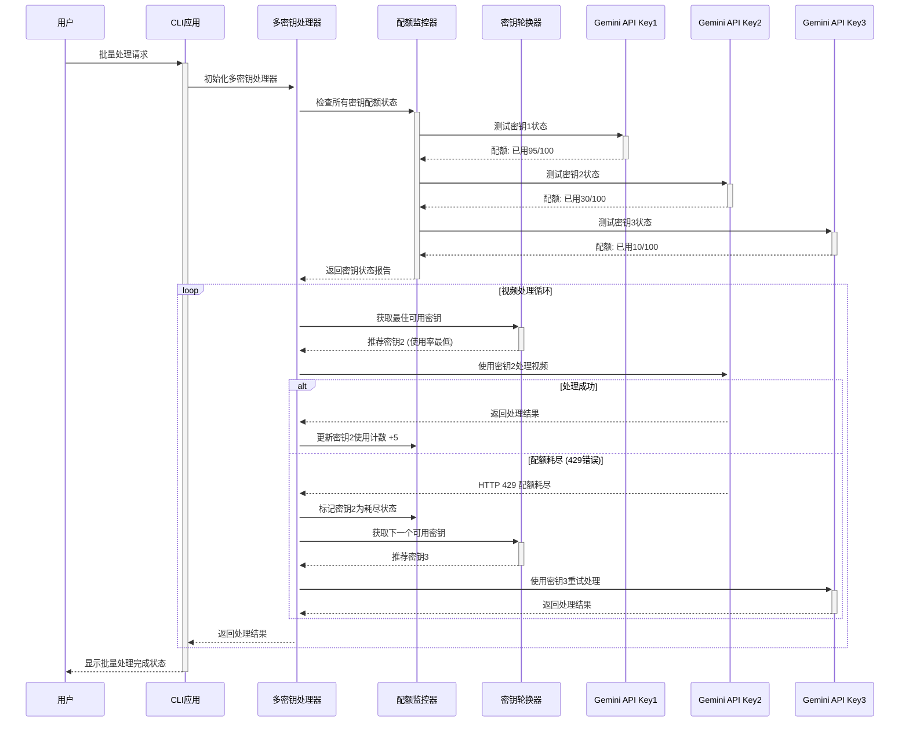
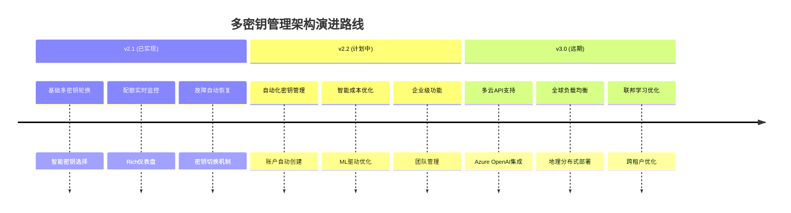

# 10. 多密钥管理架构 (Multi-Key Management Architecture)

> **版本**: v2.1 | **更新时间**: 2025-01-19  
> **状态**: ✅ 已实现 | **负责人**: @dev-team

## 🎯 架构概述

v2.1版本引入了多密钥智能轮换管理系统，彻底解决了Google Gemini API免费层每日100请求配额限制的问题，将处理能力从单账户20视频/天提升到多账户60+视频/天。

## 🏗️ 系统架构设计

### 核心组件架构



### 数据流设计



## 🔧 核心组件详解

### 1. 多密钥处理器 (MultiKeyProcessor)

**职责**: 
- 统一管理多个API密钥
- 实现智能密钥轮换逻辑
- 处理API调用失败和重试

**核心算法**:
```python
class MultiKeyProcessor:
    def get_next_active_key(self) -> Optional[str]:
        """智能密钥选择算法"""
        # 1. 筛选可用密钥（未耗尽且剩余请求>5）
        available_keys = [
            name for name, status in self.key_status.items() 
            if not status.quota_exhausted 
            and status.estimated_remaining > 5
        ]
        
        if not available_keys:
            return None
        
        # 2. 选择使用次数最少的密钥 (负载均衡)
        best_key = min(available_keys, 
                      key=lambda k: self.key_status[k].requests_used)
        return best_key
    
    def process_video_with_rotation(self, video_path, prompt):
        """带密钥轮换的视频处理"""
        max_retries = len(self.api_keys)
        
        for attempt in range(max_retries):
            key_name = self.get_next_active_key()
            if not key_name:
                return {"success": False, "error": "所有密钥均已耗尽"}
            
            try:
                result = self._process_with_specific_key(
                    video_path, prompt, key_name
                )
                self.key_status[key_name].requests_used += 5
                return {"success": True, "content": result}
                
            except QuotaExhaustedException:
                self.key_status[key_name].quota_exhausted = True
                continue  # 尝试下一个密钥
        
        return {"success": False, "error": "所有密钥重试失败"}
```

### 2. 配额监控器 (APIQuotaMonitor)

**职责**:
- 实时跟踪每个密钥的配额使用情况
- 提供可视化仪表盘
- 预测处理能力和配额重置时间

**监控指标**:
- 每个密钥的已用/剩余请求数
- 配额耗尽时间预测
- 模型可用性状态
- 处理能力估算

**关键功能**:
```python
class APIQuotaMonitor:
    def estimate_processing_capacity(self) -> Dict[str, int]:
        """估算处理能力"""
        total_remaining = sum(
            quota_info.estimated_remaining 
            for quota_info in self.quota_data.values()
            if not quota_info.quota_exhausted
        )
        
        # 每个视频大约消耗5个请求
        estimated_videos = total_remaining // 5
        
        return {
            'total_requests_remaining': total_remaining,
            'estimated_videos_processable': estimated_videos,
            'active_keys': len([q for q in self.quota_data.values() 
                               if not q.quota_exhausted])
        }
```

### 3. 密钥轮换器 (KeyRotator)

**职责**:
- 实现负载均衡算法
- 动态密钥切换策略
- 配额预测和优化

**轮换策略**:
1. **使用率均衡**: 优先选择使用次数最少的密钥
2. **配额预留**: 为每个密钥保留10个请求作为安全缓冲
3. **自动切换**: 配额接近耗尽时主动切换
4. **故障恢复**: API调用失败时立即切换到备用密钥

## 📊 配置管理架构

### 多密钥配置结构

```yaml
# multi_key_config.yaml
api_keys:
  account_1:
    key: "AIzaSyXXXXXXXXXXXXXXXXXXXXXXXXX"
    name: "主账户"
    daily_limit: 100
    priority: 1
  account_2:
    key: "AIzaSyYYYYYYYYYYYYYYYYYYYYYYYY"
    name: "备用账户1"
    daily_limit: 100
    priority: 2
  account_3:
    key: "AIzaSyZZZZZZZZZZZZZZZZZZZZZZZZ"
    name: "备用账户2"  
    daily_limit: 100
    priority: 3

processing:
  max_concurrent_keys: 2        # 最大并发密钥数
  requests_per_video: 5         # 每视频预估请求数
  safety_buffer: 10             # 安全缓冲请求数
  retry_attempts: 3             # 重试次数
  exponential_backoff: true     # 指数退避重试

monitoring:
  check_interval: 300           # 检查间隔(秒)
  quota_warning_threshold: 20   # 配额警告阈值
  save_status_file: true        # 保存状态文件
  enable_dashboard: true        # 启用仪表盘
```

### 状态持久化设计

```python
@dataclass
class QuotaInfo:
    """配额信息数据模型"""
    key_name: str
    api_key: str
    total_requests: int = 0
    successful_requests: int = 0
    failed_requests: int = 0
    quota_exhausted: bool = False
    last_request_time: Optional[datetime] = None
    last_error: Optional[str] = None
    estimated_remaining: int = 100
    reset_time: Optional[datetime] = None

# 状态文件格式 (quota_status.json)
{
  "quota_data": {
    "account_1": {
      "key_name": "account_1",
      "total_requests": 95,
      "quota_exhausted": true,
      "estimated_remaining": 0,
      "last_request_time": "2025-01-19T10:30:00",
      "reset_time": "2025-01-20T00:00:00"
    }
  },
  "last_updated": "2025-01-19T10:35:00"
}
```

## ⚡ 性能优化策略

### 1. 并发控制优化

```python
class AdaptiveConcurrencyControl:
    """自适应并发控制"""
    
    def __init__(self, available_keys: int):
        self.available_keys = available_keys
        self.optimal_workers = min(available_keys, 4)
    
    def get_worker_count(self, queue_size: int) -> int:
        """根据队列大小动态调整并发数"""
        if queue_size < 10:
            return max(1, self.optimal_workers // 2)
        elif queue_size < 50:
            return self.optimal_workers
        else:
            return min(self.optimal_workers * 2, self.available_keys)
```

### 2. 请求优化策略

| 策略 | 节省效果 | 实现复杂度 | v2.1状态 |
|------|----------|------------|----------|
| 多密钥轮换 | 300%+ | 中等 | ✅ 已实现 |
| 请求批量化 | 20-30% | 简单 | 🚧 计划中 |
| 响应缓存 | 50-70% | 中等 | 🚧 计划中 |
| 智能重试 | 10-15% | 简单 | ✅ 已实现 |

### 3. 成本控制措施

```python
class CostOptimizer:
    """成本优化器"""
    
    def select_optimal_model(self, video_length: int) -> str:
        """根据视频长度选择最优模型"""
        if video_length < 300:  # 5分钟以下
            return "gemini-2.5-flash"    # 更经济
        else:
            return "gemini-2.5-pro"      # 更准确
    
    def estimate_daily_cost(self, video_count: int) -> Dict:
        """估算每日成本"""
        requests_needed = video_count * 5
        keys_required = math.ceil(requests_needed / 90)  # 90请求/密钥
        
        return {
            "videos": video_count,
            "requests_total": requests_needed,
            "keys_required": keys_required,
            "accounts_needed": keys_required
        }
```

## 🔍 监控和可观测性

### 1. 实时监控仪表盘

```
🚀 Google Gemini API 配额监控仪表盘

📊 整体状态概览
活跃密钥: 2/3
剩余请求: ~150 个  
可处理视频: ~30 个

密钥状态详情
┌─────────────┬──────────┬──────────┬──────────┐
│ 密钥名称    │ 状态     │ 已用请求 │ 剩余估算 │
├─────────────┼──────────┼──────────┼──────────┤
│ account_1   │ ❌ 耗尽  │ 100      │ 0        │
│ account_2   │ ✅ 良好  │ 25       │ 75       │  
│ account_3   │ ✅ 良好  │ 30       │ 70       │
└─────────────┴──────────┴──────────┴──────────┘

🤖 可用模型状态
✅ gemini-2.5-pro: 可用
✅ gemini-2.5-flash: 可用
```

### 2. 关键指标追踪

```python
class MetricsCollector:
    """指标收集器"""
    
    def collect_key_metrics(self) -> Dict:
        return {
            # 配额指标
            "quota_utilization_rate": self.calculate_utilization_rate(),
            "keys_exhausted_count": self.count_exhausted_keys(),
            "estimated_reset_time": self.get_next_reset_time(),
            
            # 性能指标
            "requests_per_second": self.calculate_rps(),
            "success_rate": self.calculate_success_rate(),
            "average_response_time": self.calculate_avg_response_time(),
            
            # 失败率指标 (新增)
            "api_failure_rate": self.calculate_failure_rate(),
            "consecutive_failures": self.get_max_consecutive_failures(),
            "quota_exhausted_rate": self.calculate_quota_exhausted_rate(),
            "rate_limit_rate": self.calculate_rate_limit_rate(),
            
            # 业务指标
            "videos_processed_today": self.count_videos_processed(),
            "processing_capacity_remaining": self.estimate_remaining_capacity(),
            "cost_efficiency": self.calculate_cost_per_video()
        }
    
    def calculate_failure_rate(self) -> float:
        """计算整体API失败率"""
        total_requests = sum(stats.total_requests for stats in self.key_stats.values())
        total_failures = sum(stats.failed_requests for stats in self.key_stats.values())
        
        if total_requests == 0:
            return 0.0
        return (total_failures / total_requests) * 100
    
    def get_key_failure_rates(self) -> Dict[str, float]:
        """获取各密钥的失败率"""
        failure_rates = {}
        for key_id, stats in self.key_stats.items():
            if stats.total_requests > 0:
                failure_rate = (stats.failed_requests / stats.total_requests) * 100
                failure_rates[key_id] = failure_rate
            else:
                failure_rates[key_id] = 0.0
        return failure_rates
```

### 2.1 API失败率监控架构

#### 失败率统计数据模型

```python
@dataclass
class KeyUsageStats:
    """API密钥使用统计"""
    key_id: str                           # 密钥ID（前4位+后4位）
    total_requests: int = 0               # 总请求数
    successful_requests: int = 0          # 成功请求数
    failed_requests: int = 0              # 失败请求数
    quota_exhausted_count: int = 0        # 配额耗尽次数
    rate_limit_count: int = 0             # 速率限制次数
    last_used: Optional[str] = None       # 最后使用时间
    last_success: Optional[str] = None    # 最后成功时间
    last_failure: Optional[str] = None    # 最后失败时间
    current_status: str = "unknown"       # 当前状态
    consecutive_failures: int = 0         # 连续失败次数

    def success_rate(self) -> float:
        """计算成功率"""
        if self.total_requests == 0:
            return 0.0
        return self.successful_requests / self.total_requests

    def failure_rate(self) -> float:
        """计算失败率"""
        if self.total_requests == 0:
            return 0.0
        return self.failed_requests / self.total_requests

    def is_healthy(self) -> bool:
        """判断密钥是否健康"""
        # 连续失败超过5次认为不健康
        if self.consecutive_failures > 5:
            return False
        # 成功率低于50%且请求数超过10次认为不健康
        if self.total_requests > 10 and self.success_rate() < 0.5:
            return False
        return True
```

#### 失败率监控工具集

**1. 实时失败率监控**:
```bash
# 启动实时监控
python scripts/monitor_api_rates.py

# 自定义监控间隔
python scripts/monitor_api_rates.py --interval 10
```

**2. 详细失败率分析**:
```bash
# 查看所有密钥的失败率统计
python scripts/view_api_failure_rates.py

# 查看特定日志文件
python scripts/view_api_failure_rates.py logs/api_key_usage.json
```

**3. 失败率验证和计算**:
```bash
# 验证失败率计算的正确性
python3 -c "
import json
with open('logs/api_key_usage.json', 'r') as f:
    stats = json.load(f)
for key_id, data in stats.items():
    if data['total_requests'] > 0:
        failure_rate = (data['failed_requests'] / data['total_requests']) * 100
        print(f'{key_id}: 失败率 {failure_rate:.1f}%')
"
```

#### 失败率质量标准

| 失败率范围 | 健康状态 | 行动建议 | 自动化处理 |
|------------|----------|----------|------------|
| 0-10% | 🟢 优秀 | 继续监控 | 正常使用 |
| 10-30% | 🟡 良好 | 注意观察 | 继续使用 |
| 30-60% | 🟠 警告 | 考虑轮换 | 降低优先级 |
| 60-90% | 🔴 严重 | 立即切换 | 暂停使用 |
| >90% | 🚫 无效 | 检查配置 | 标记无效 |

### 3. 告警和通知

```python
class AlertManager:
    """告警管理器"""
    
    def check_alert_conditions(self):
        """检查告警条件"""
        conditions = {
            "quota_warning": self.quota_usage > 80,
            "quota_critical": self.quota_usage > 95,
            "all_keys_exhausted": self.active_keys == 0,
            "processing_capacity_low": self.remaining_videos < 10,
            "api_error_rate_high": self.error_rate > 10,
            
            # API失败率告警 (新增)
            "api_failure_rate_warning": self.calculate_failure_rate() > 30,
            "api_failure_rate_critical": self.calculate_failure_rate() > 60,
            "consecutive_failures_high": any(
                stats.consecutive_failures > 5 
                for stats in self.key_stats.values()
            ),
            "key_health_degraded": any(
                not stats.is_healthy() 
                for stats in self.key_stats.values()
            )
        }
        
        for condition, triggered in conditions.items():
            if triggered:
                self.send_alert(condition)
    
    def send_failure_rate_alert(self, failure_rate: float, key_id: str = None):
        """发送失败率告警"""
        if key_id:
            message = f"🚨 API密钥 {key_id} 失败率过高: {failure_rate:.1f}%"
        else:
            message = f"🚨 整体API失败率过高: {failure_rate:.1f}%"
        
        alert_data = {
            "type": "failure_rate_alert",
            "severity": "critical" if failure_rate > 60 else "warning",
            "message": message,
            "failure_rate": failure_rate,
            "key_id": key_id,
            "timestamp": datetime.now().isoformat(),
            "recommended_action": self.get_failure_rate_recommendation(failure_rate)
        }
        
        self.notify_channels(alert_data)
    
    def get_failure_rate_recommendation(self, failure_rate: float) -> str:
        """根据失败率获取建议操作"""
        if failure_rate > 90:
            return "立即检查API密钥配置，暂停使用该密钥"
        elif failure_rate > 60:
            return "立即切换到备用密钥，检查网络连接"
        elif failure_rate > 30:
            return "考虑密钥轮换，监控后续请求"
        else:
            return "继续监控，暂无行动需要"
```

## 🚨 故障恢复和容错设计

### 1. 故障类型和处理策略

| 故障类型 | 检测方式 | 恢复策略 | 预防措施 |
|---------|----------|----------|----------|
| 配额耗尽 | HTTP 429响应 | 立即切换密钥 | 配额监控预警 |
| 密钥无效 | HTTP 401响应 | 跳过无效密钥 | 定期密钥验证 |
| 网络超时 | 连接超时 | 指数退避重试 | 超时参数调优 |
| API服务异常 | HTTP 5xx响应 | 等待后重试 | 服务状态监控 |

### 2. 自动恢复机制

```python
class RecoveryManager:
    """恢复管理器"""
    
    def handle_quota_exhaustion(self, exhausted_key: str):
        """处理配额耗尽"""
        # 1. 标记密钥为耗尽状态
        self.mark_key_exhausted(exhausted_key)
        
        # 2. 计算配额重置时间
        reset_time = self.calculate_reset_time()
        
        # 3. 检查是否还有可用密钥
        if self.get_active_keys_count() == 0:
            self.send_alert("ALL_KEYS_EXHAUSTED")
            self.suggest_recovery_actions()
        
        # 4. 调整处理计划
        self.adjust_processing_plan()
    
    def suggest_recovery_actions(self):
        """建议恢复措施"""
        suggestions = [
            "等待配额重置（UTC 00:00）",
            "创建新的Google账户获取API密钥",
            "考虑升级到付费API计划",
            "使用更经济的模型（gemini-1.5-flash）"
        ]
        return suggestions
```

## 📈 容量规划和扩展

### 1. 容量规划模型

```python
def calculate_capacity_requirements(target_videos_per_day: int) -> Dict:
    """计算容量需求"""
    requests_per_video = 5
    requests_per_key_per_day = 90  # 保留10个作为缓冲
    
    total_requests = target_videos_per_day * requests_per_video
    keys_required = math.ceil(total_requests / requests_per_key_per_day)
    
    return {
        "target_videos": target_videos_per_day,
        "total_requests_needed": total_requests,
        "api_keys_required": keys_required,
        "google_accounts_needed": keys_required,
        "daily_processing_capacity": keys_required * requests_per_key_per_day // requests_per_video
    }

# 示例计算
# 目标: 处理100个视频/天
# 需求: 500个请求
# 密钥数: 6个密钥 (500/90 = 5.56 ≈ 6)
# 实际容量: 108个视频/天 (6*90/5)
```

### 2. 自动扩展策略

```python
class AutoScaler:
    """自动扩展器"""
    
    def evaluate_scaling_needs(self) -> Dict[str, Any]:
        """评估扩展需求"""
        current_capacity = self.get_current_capacity()
        usage_trend = self.analyze_usage_trend()
        predicted_demand = self.predict_future_demand()
        
        if predicted_demand > current_capacity * 0.8:
            return {
                "scale_action": "SCALE_UP",
                "additional_keys_needed": self.calculate_additional_keys(predicted_demand),
                "urgency": "HIGH" if predicted_demand > current_capacity else "MEDIUM"
            }
        
        return {"scale_action": "MAINTAIN", "urgency": "LOW"}
```

## 🔮 未来演进规划

### v2.2 计划增强 (企业级功能)

1. **自动密钥管理**
   - Google账户自动化创建
   - API密钥自动申请和激活
   - 密钥生命周期自动管理

2. **智能成本优化** 
   - 机器学习驱动的请求优化
   - 动态模型选择算法
   - 预测性配额管理

3. **企业级监控**
   - 团队配额池共享
   - 详细成本分析和计费
   - 合规性和审计报告

### 长期技术路线



---

## 📞 架构支持

### 技术咨询
- **架构设计**: @architect
- **实现细节**: @dev-team  
- **性能优化**: @performance-team

### 相关文档
- [配额管理指南](../guides/QUOTA_MANAGEMENT_GUIDE.md) - 用户操作指南
- [故障排查指南](../troubleshooting/API_TROUBLESHOOTING_GUIDE.md) - 问题解决方案
- [核心工作流](./5-核心工作流-core-workflow.md) - 整体处理流程

---

*最后更新: 2025-01-19 | gs_videoReport v2.1 | 多密钥管理架构*
