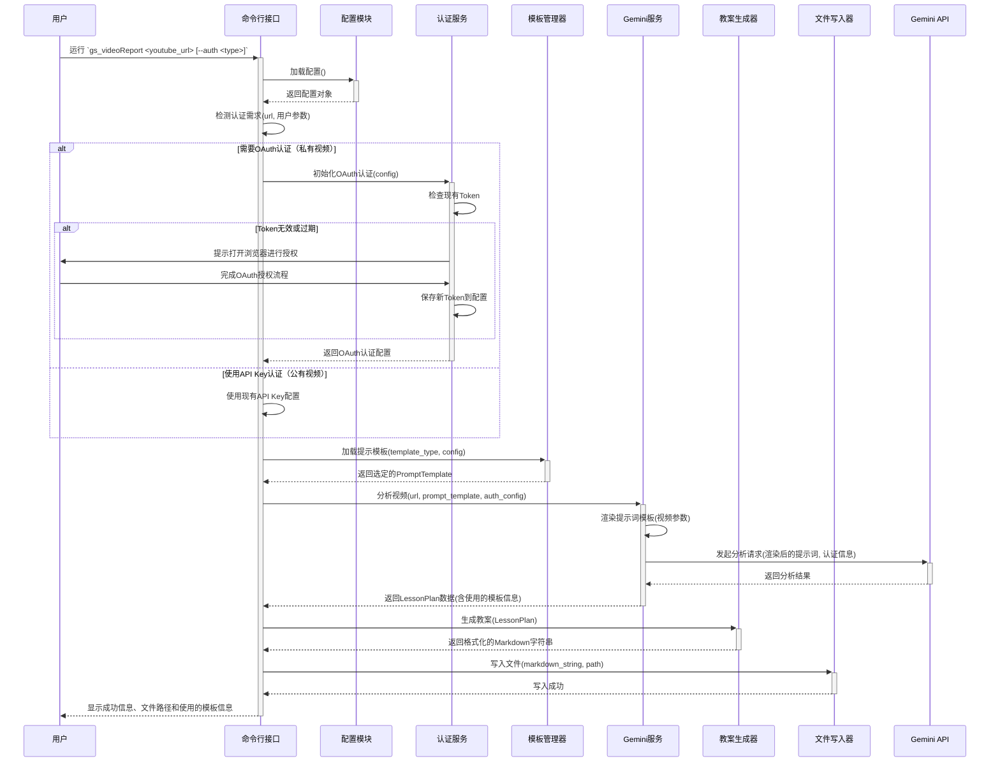

# 5. 核心工作流 (Core Workflow)

```mermaid
sequenceDiagram
    participant User as 用户
    participant CLI as 命令行接口
    participant Config as 配置模块
    participant AuthService as 认证服务
    participant TemplateManager as 模板管理器
    participant GeminiService as Gemini服务
    participant ReportGenerator as 教案生成器
    participant FileWriter as 文件写入器

    User->>+CLI: 运行 `gs_videoReport <youtube_url> [--auth <type>]`
    CLI->>+Config: 加载配置()
    Config-->>-CLI: 返回配置对象
    
    CLI->>CLI: 检测认证需求(url, 用户参数)
    
    alt 需要OAuth认证（私有视频）
        CLI->>+AuthService: 初始化OAuth认证(config)
        AuthService->>AuthService: 检查现有Token
        alt Token无效或过期
            AuthService->>User: 提示打开浏览器进行授权
            User->>AuthService: 完成OAuth授权流程
            AuthService->>AuthService: 保存新Token到配置
        end
        AuthService-->>-CLI: 返回OAuth认证配置
    else 使用API Key认证（公有视频）
        CLI->>CLI: 使用现有API Key配置
    end
    
    CLI->>+TemplateManager: 加载提示模板(template_type, config)
    TemplateManager-->>-CLI: 返回选定的PromptTemplate
    CLI->>+GeminiService: 分析视频(url, prompt_template, auth_config)
    GeminiService->>GeminiService: 渲染提示词模板(视频参数)
    GeminiService->>+Gemini API: 发起分析请求(渲染后的提示词, 认证信息)
    Gemini API-->>-GeminiService: 返回分析结果
    GeminiService-->>-CLI: 返回LessonPlan数据(含使用的模板信息)
    CLI->>+ReportGenerator: 生成教案(LessonPlan)
    ReportGenerator-->>-CLI: 返回格式化的Markdown字符串
    CLI->>+FileWriter: 写入文件(markdown_string, path)
    FileWriter-->>-CLI: 写入成功
    CLI-->>-User: 显示成功信息、文件路径和使用的模板信息
```
