# 5. 核心工作流 (Core Workflow)

> **版本**: v2.2 | **更新**: 2025-08-19 | **新增**: 动态并行处理与专用Worker工作流

## v0.1.1 基础工作流 (单密钥版本)

```mermaid
sequenceDiagram
    participant User as 用户
    participant CLI as 命令行接口
    participant Config as 配置模块
    participant AuthService as 认证服务
    participant TemplateManager as 模板管理器
    participant GeminiService as Gemini服务
    participant ReportGenerator as 教案生成器
    participant FileWriter as 文件写入器

    User->>+CLI: 运行 `gs_videoReport <youtube_url> [--auth <type>]`
    CLI->>+Config: 加载配置()
    Config-->>-CLI: 返回配置对象
    
    CLI->>CLI: 检测认证需求(url, 用户参数)
    
    alt 需要OAuth认证（私有视频）
        CLI->>+AuthService: 初始化OAuth认证(config)
        AuthService->>AuthService: 检查现有Token
        alt Token无效或过期
            AuthService->>User: 提示打开浏览器进行授权
            User->>AuthService: 完成OAuth授权流程
            AuthService->>AuthService: 保存新Token到配置
        end
        AuthService-->>-CLI: 返回OAuth认证配置
    else 使用API Key认证（公有视频）
        CLI->>CLI: 使用现有API Key配置
    end
    
    CLI->>+TemplateManager: 加载提示模板(template_type, config)
    TemplateManager-->>-CLI: 返回选定的PromptTemplate
    CLI->>+GeminiService: 分析视频(url, prompt_template, auth_config)
    GeminiService->>GeminiService: 渲染提示词模板(视频参数)
    GeminiService->>+Gemini API: 发起分析请求(渲染后的提示词, 认证信息)
    Gemini API-->>-GeminiService: 返回分析结果
    GeminiService-->>-CLI: 返回LessonPlan数据(含使用的模板信息)
    CLI->>+ReportGenerator: 生成教案(LessonPlan)
    ReportGenerator-->>-CLI: 返回格式化的Markdown字符串
    CLI->>+FileWriter: 写入文件(markdown_string, path)
    FileWriter-->>-CLI: 写入成功
    CLI-->>-User: 显示成功信息、文件路径和使用的模板信息
```

## 🆕 v2.1 多密钥智能轮换工作流

```mermaid
sequenceDiagram
    participant User as 用户
    participant CLI as 命令行接口
    participant MKP as 多密钥处理器
    participant QM as 配额监控器
    participant TM as 模板管理器
    participant API1 as Gemini API Key1
    participant API2 as Gemini API Key2
    participant API3 as Gemini API Key3
    participant FileWriter as 文件写入器

    User->>+CLI: 批量处理命令 (batch test_videos/)
    CLI->>+MKP: 初始化多密钥处理器
    
    MKP->>+QM: 检查所有密钥配额状态
    QM->>API1: 测试密钥1 (已用95/100)
    QM->>API2: 测试密钥2 (已用20/100)  
    QM->>API3: 测试密钥3 (已用5/100)
    QM-->>-MKP: 返回密钥状态 {Key1:耗尽, Key2:良好, Key3:良好}
    
    MKP->>+TM: 获取v2.0中文模板 (chinese_transcript)
    TM-->>-MKP: 返回优化模板 (Temperature:1.0, MaxTokens:65536)
    
    loop 批量视频处理
        MKP->>QM: 选择最佳可用密钥
        QM-->>MKP: 推荐Key3 (使用率最低)
        
        MKP->>+API3: 使用Key3处理视频 + 纯中文模板
        
        alt 处理成功
            API3-->>MKP: 返回纯中文逐字稿
            MKP->>QM: 更新Key3使用计数 (+5请求)
            MKP->>+FileWriter: 写入中文教案文件
            FileWriter-->>-MKP: 文件写入成功
        
        else API配额耗尽 (HTTP 429)
            API3-->>MKP: 配额耗尽错误
            MKP->>QM: 标记Key3为耗尽状态
            MKP->>QM: 获取下一个可用密钥
            QM-->>MKP: 推荐Key2
            
            MKP->>+API2: 使用Key2重试处理
            API2-->>-MKP: 返回处理结果
            MKP->>QM: 更新Key2使用计数
        
        else 所有密钥耗尽
            MKP-->>CLI: 返回配额耗尽错误 + 恢复建议
        end
        
        MKP-->>CLI: 返回单个视频处理结果
    end
    
    CLI->>+QM: 生成最终状态报告
    QM-->>-CLI: 配额使用报告 + 剩余容量预估
    CLI-->>-User: 显示批量处理完成 + 状态仪表盘
```

## 🔄 多密钥轮换决策逻辑

```mermaid
flowchart TD
    A[接收视频处理请求] --> B[检查可用密钥]
    
    B --> C{是否有可用密钥?}
    C -->|否| D[返回配额耗尽错误]
    C -->|是| E[选择使用率最低的密钥]
    
    E --> F[使用选定密钥发起API调用]
    
    F --> G{API调用结果}
    G -->|成功| H[更新密钥使用计数]
    G -->|429配额错误| I[标记密钥为耗尽]
    G -->|其他错误| J[记录错误并重试]
    
    H --> K[返回处理结果]
    
    I --> L{还有其他可用密钥?}
    L -->|是| E
    L -->|否| M[返回所有密钥耗尽错误]
    
    J --> N{重试次数<3?}
    N -->|是| F
    N -->|否| O[返回处理失败错误]
    
    K --> P[完成处理]
    D --> P
    M --> P
    O --> P
```

