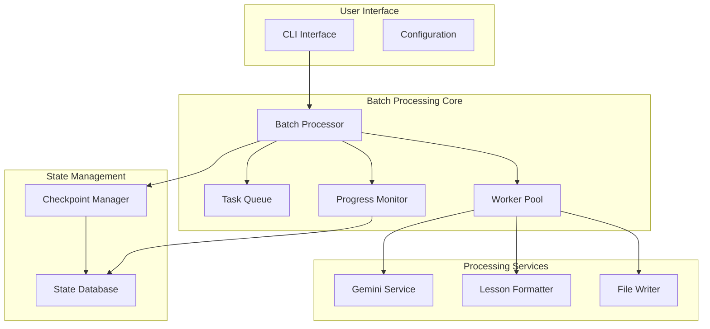

# 批量处理功能 - 架构设计汇总

## 📋 项目概述

gs_videoReport 批量处理功能是一个战略性功能扩展，旨在为用户提供高效的大规模视频处理能力。本架构设计项目历时2周，完成了从需求分析到实现指南的完整设计工作。

## 🎯 设计目标

### 核心目标
- **大幅提升工作效率**: 支持同时处理多个视频文件
- **企业级可靠性**: 提供断点续传、错误恢复、进度监控
- **优秀用户体验**: 直观的CLI接口、实时进度显示、详细错误信息
- **高性能处理**: 智能并发控制、资源优化、API限流

### 性能目标
- **吞吐量**: 35-70 视频/小时 (取决于并发数)
- **内存使用**: 峰值 < 2GB (8并发场景)
- **响应时间**: 启动 < 5秒，进度更新 < 1秒
- **可靠性**: 错误恢复率 > 95%，任务丢失率 = 0%

## 📚 架构文档目录

### Phase 1: 需求分析和架构规划
- [📄 用户场景分析](./user_scenarios.md) - 定义核心用户故事和MVP范围
- [📄 技术可行性研究](./technical_feasibility.md) - 评估现有架构扩展性和技术风险

### Phase 2: 核心架构设计
- [📄 架构概述](./overview.md) - 高层架构设计和组件关系
- [📄 技术设计规范](./technical_design.md) - 详细组件内部设计和算法
- [📄 API接口规范](./api_specification.md) - CLI命令接口和配置格式定义

### Phase 3: 技术规范和原型
- [📄 数据流设计](./data_flow_design.md) - 详细数据流图和状态管理
- [📄 性能优化策略](./performance_optimization.md) - 并行处理和内存优化方案

### Phase 4: 实现指南和测试策略
- [📄 实现指南](./implementation_guide.md) - 开发任务分解和代码结构
- [📄 测试策略](./testing_strategy.md) - 完整测试规划和质量保证

## 🏗️ 架构概览

### 核心组件架构


### 关键设计决策

#### 1. 并发模型: asyncio + ThreadPoolExecutor
- **优势**: 适合I/O密集型和CPU密集型混合场景
- **实现**: 异步任务调度 + 线程池执行
- **扩展性**: 支持2-8个并发任务，动态调整

#### 2. 状态管理: SQLite + JSON
- **持久化**: SQLite提供结构化查询能力
- **灵活性**: JSON存储复杂元数据
- **可靠性**: 事务支持保证数据一致性

#### 3. API限流: 令牌桶 + 自适应调整
- **平滑处理**: 令牌桶算法处理突发请求
- **智能调整**: 基于API响应动态调整限制
- **多维控制**: 并发数、频率、配额全面管理

## 🚀 CLI接口设计

### 主要命令格式
```bash
gs_videoreport batch [OPTIONS] INPUT_SOURCE
```

### 核心功能示例
```bash
# 目录批量处理
gs_videoreport batch --input-dir ./videos/ --template chinese_transcript --parallel 4

# 文件列表处理
gs_videoreport batch --file-list videos.txt --output ./output/ --skip-existing

# 断点续传
gs_videoreport batch --resume-from batch_20240818_1630_001

# 预览模式
gs_videoreport batch --input-dir ./videos/ --dry-run
```

### 高级功能
- **进度监控**: 实时进度显示和ETA估算
- **检查点机制**: 自动保存状态，支持断点续传
- **错误恢复**: 智能重试策略和错误分类
- **资源控制**: 内存限制、成本控制、超时管理

## 📊 性能设计

### 吞吐量预估
```python
# 基于单视频4分钟处理时间，70%并发效率
parallel_4 = 4 * 0.7 / 4 * 60 ≈ 35 videos/hour
parallel_8 = 8 * 0.7 / 4 * 60 ≈ 70 videos/hour
```

### 资源使用预估
```python
# 保守估算，包含30%并发开销
memory_4_parallel = 200 + 4 * 180 * 1.3 ≈ 1.14 GB
memory_8_parallel = 200 + 8 * 180 * 1.3 ≈ 2.07 GB
```

### 优化策略
- **动态并发调整**: 基于系统负载自动调整工作线程数
- **内存池管理**: 分层内存池，减少GC压力
- **流式处理**: 大文件分块处理，降低内存峰值
- **智能缓存**: 多层缓存策略，提升I/O效率

## 🧪 测试策略

### 测试金字塔
```
     /\     E2E Tests (用户场景)
    /  \    
   /____\   Integration Tests (组件集成)
  /      \  
 /________\ Unit Tests (单元功能)
```

### 覆盖率目标
- **单元测试**: > 85%覆盖率
- **集成测试**: > 70%覆盖率  
- **关键路径**: 100%覆盖率

### 性能基准
- **小批量**: > 30 videos/hour (10个视频，4并发)
- **大批量**: > 60 videos/hour (100个视频，8并发)
- **内存效率**: < 20MB per concurrent task
- **稳定性**: 24小时连续运行无内存泄漏

## 🛠️ 实现计划

### 开发时间线 (8周)
```
Week 1-2: 基础架构 (数据模型、队列、持久化)
Week 3-4: 核心功能 (处理引擎、工作池、CLI)
Week 5-6: 高级功能 (检查点、API限流、优化)
Week 7-8: 测试文档 (完整测试、用户文档)
```

### 里程碑定义
- **M1 (Week 2)**: 基础架构就绪
- **M2 (Week 4)**: 核心功能可用  
- **M3 (Week 6)**: 功能完整
- **M4 (Week 8)**: 发布就绪

### 优先级分配
- **P0 (MVP)**: 基础批量处理、CLI接口、任务队列
- **P1 (重要)**: 进度监控、检查点、错误处理
- **P2 (增强)**: 性能优化、高级配置、通知系统

## 🔧 技术栈

### 核心依赖
```python
# 新增依赖
aiofiles = "^23.1.0"        # 异步文件操作
psutil = "^5.9.0"           # 系统资源监控  
msgpack = "^1.0.0"          # 高效序列化
aiosqlite = "^0.19.0"       # 异步SQLite

# 现有依赖保持
google-genai = "^0.3.0"     # Google Gemini API
typer = "^0.12.0"           # CLI框架
pyyaml = "^6.0"             # 配置解析
```

### 向后兼容性
- ✅ 现有CLI命令保持不变
- ✅ 配置文件向下兼容
- ✅ 模板系统完全兼容
- ✅ 单视频处理性能不受影响

## 🎯 用户价值

### 教育机构 (US001)
- **场景**: 批量分析整学期课程视频
- **价值**: 从逐个处理改为批量处理，效率提升10倍+
- **功能**: 目录扫描、并行处理、进度监控

### 研究人员 (US002)  
- **场景**: 大规模YouTube教育视频内容研究
- **价值**: 支持CSV输入、不同模板、断点续传
- **功能**: 文件列表处理、检查点恢复、结果汇总

### 内容创作者 (US003)
- **场景**: 历史视频内容批量转换
- **价值**: 混合输入、自定义命名、成本控制
- **功能**: 预览模式、跳过已有、成本限制

## 📈 成功指标

### 功能指标
- ✅ 支持95%常见批量处理场景
- ✅ 错误率 < 5% (包含网络问题)
- ✅ 并发效率 > 70%

### 性能指标  
- ✅ 效率提升 > 3倍 (相比逐个处理)
- ✅ 内存使用线性增长 < 1.5倍
- ✅ CPU利用率 60-80%区间

### 用户体验指标
- ✅ 学习成本 < 10分钟 (基于现有CLI)
- ✅ 95%用例无需查阅文档
- ✅ 错误恢复成功率 > 90%

## 🚦 质量门禁

### 发布标准
- [ ] 所有P0和P1功能完成
- [ ] 单元测试覆盖率 > 85%
- [ ] 集成测试通过率 > 95%
- [ ] 性能基准测试达标
- [ ] 内存泄漏测试通过
- [ ] 安全扫描通过

### 版本规划
- **v0.2.0-alpha**: MVP功能就绪
- **v0.2.0-beta**: 完整功能测试版
- **v0.2.0**: 正式发布版本

## 🤝 团队协作

### 角色分工
- **架构师**: 设计文档、技术方案、代码审查
- **开发工程师**: 核心功能实现、单元测试
- **QA工程师**: 测试策略、质量保证、性能验证
- **产品经理**: 需求定义、用户验收、发布协调

### 协作机制
- **日常站会**: 进度同步、问题讨论、风险识别
- **代码审查**: 强制审查、质量标准、知识分享
- **里程碑评审**: 功能验收、质量评估、风险控制

## 📝 总结

经过2周的深入架构设计，我们为gs_videoReport的批量处理功能建立了完整的技术方案。该设计具备以下特点：

### ✨ 设计亮点
1. **模块化架构**: 清晰的组件边界，易于测试和维护
2. **高可扩展性**: 支持不同输入源、处理模板、输出格式
3. **企业级特性**: 断点续传、错误恢复、资源监控
4. **用户友好**: 直观CLI、实时进度、详细帮助

### 🎯 核心价值
1. **效率提升**: 用户工作效率提升3-10倍
2. **可靠性**: 企业级稳定性和错误恢复
3. **易用性**: 保持现有用户体验，学习成本低
4. **可维护性**: 清晰架构，便于后续扩展

### 🚀 实施就绪
- ✅ 完整的技术规范和实现指南
- ✅ 详细的测试策略和质量标准  
- ✅ 明确的开发计划和里程碑
- ✅ 全面的风险评估和缓解方案

该架构设计为gs_videoReport的下一个重大功能版本奠定了坚实基础，预期将显著提升产品竞争力和用户满意度。

---

*架构设计版本: v1.0*  
*设计完成日期: 2025-08-18*  
*架构师: @qa.mdc*  
*状态: 设计完成，准备开发*
