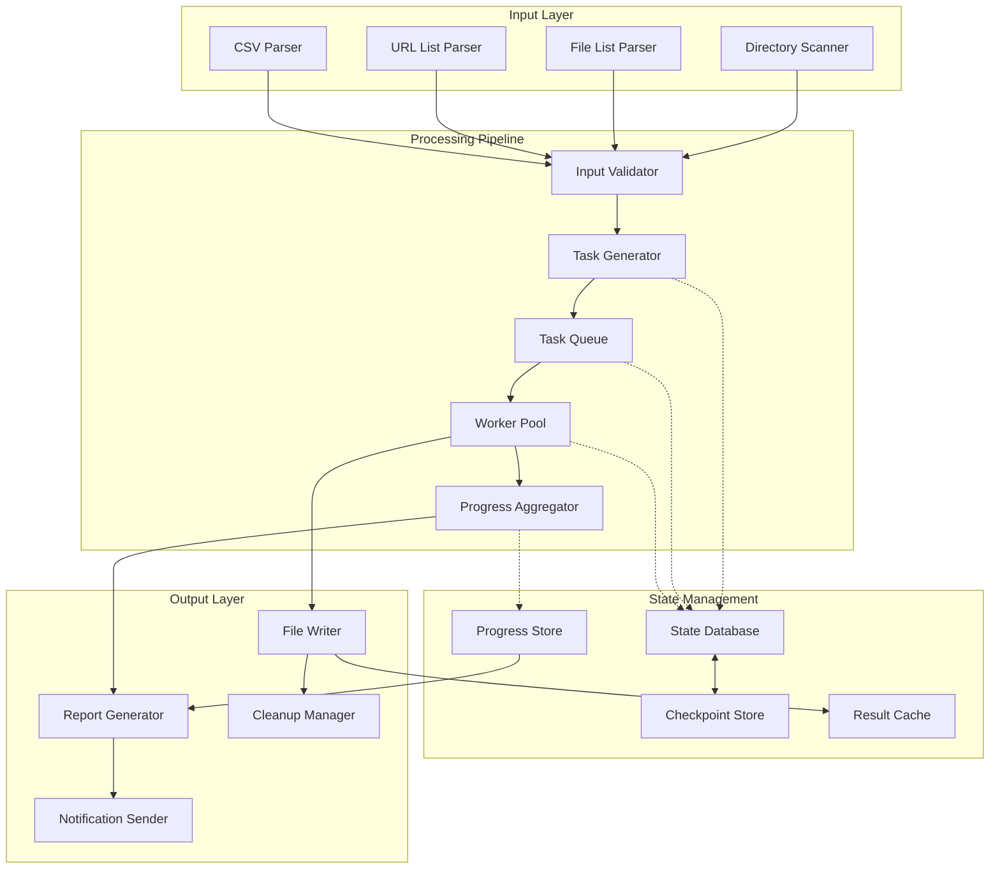
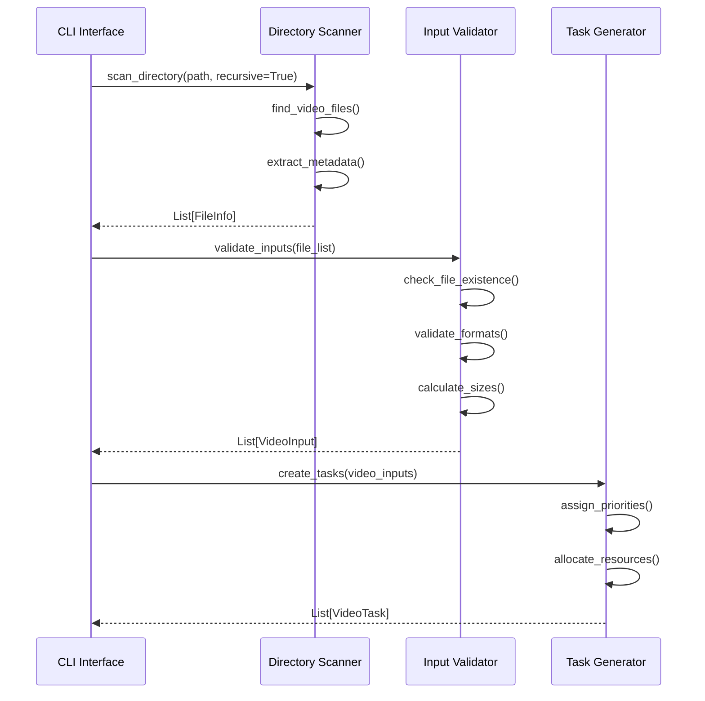
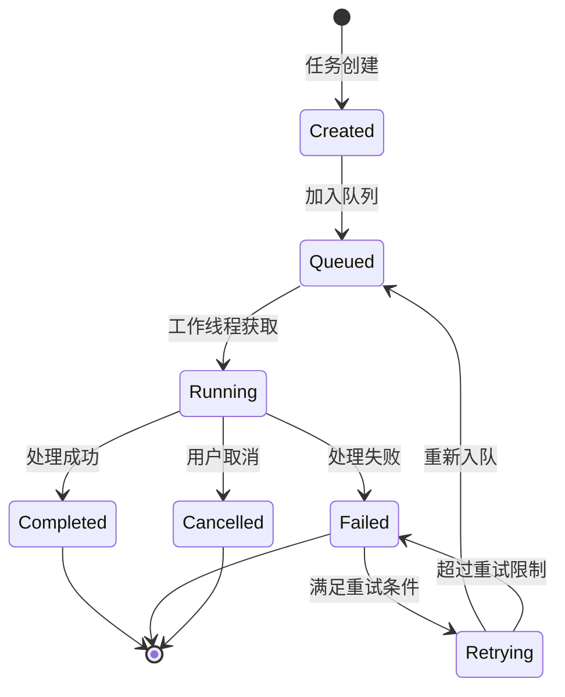
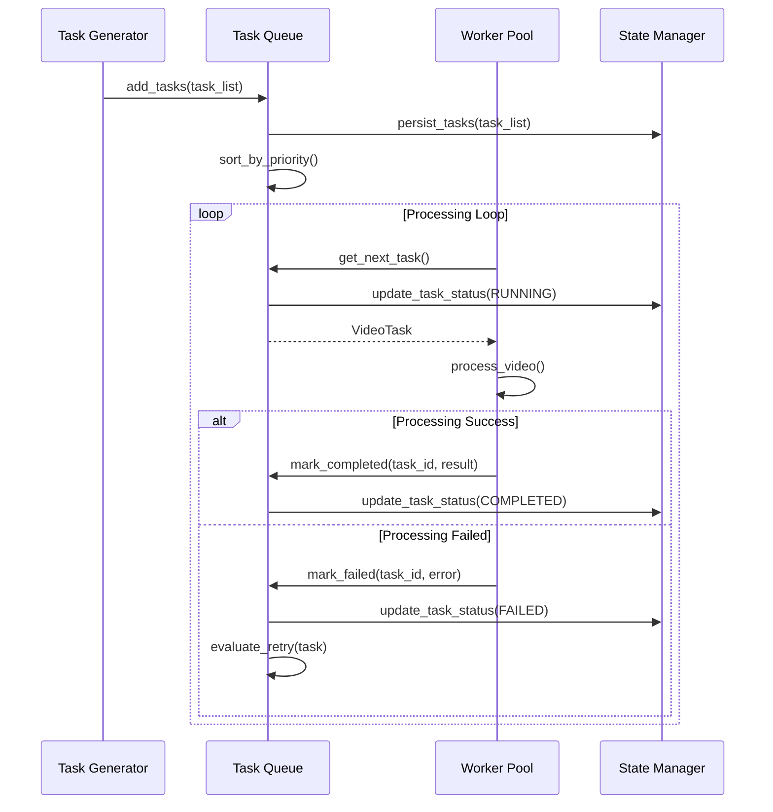
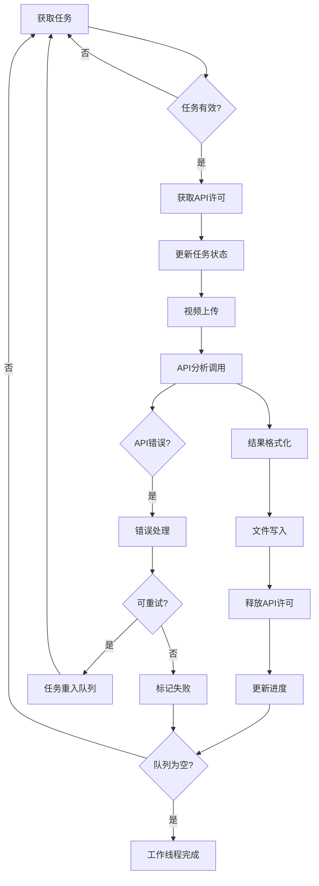
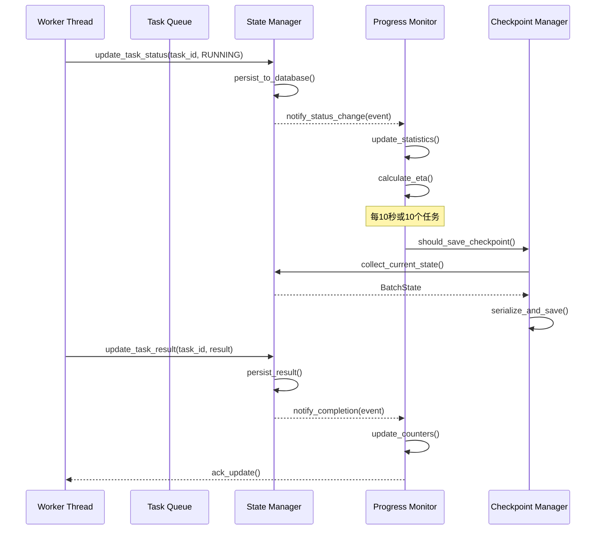
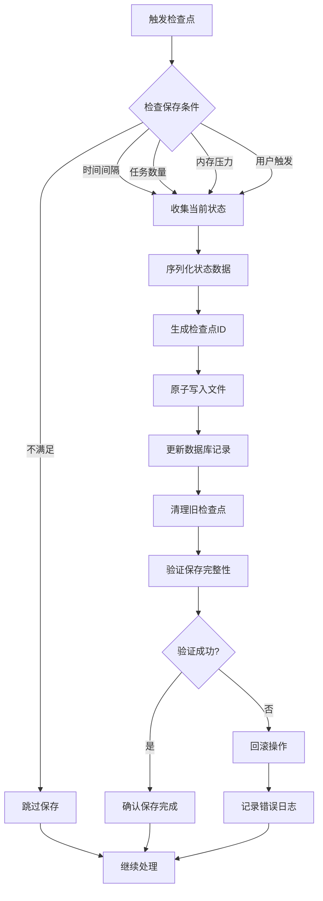
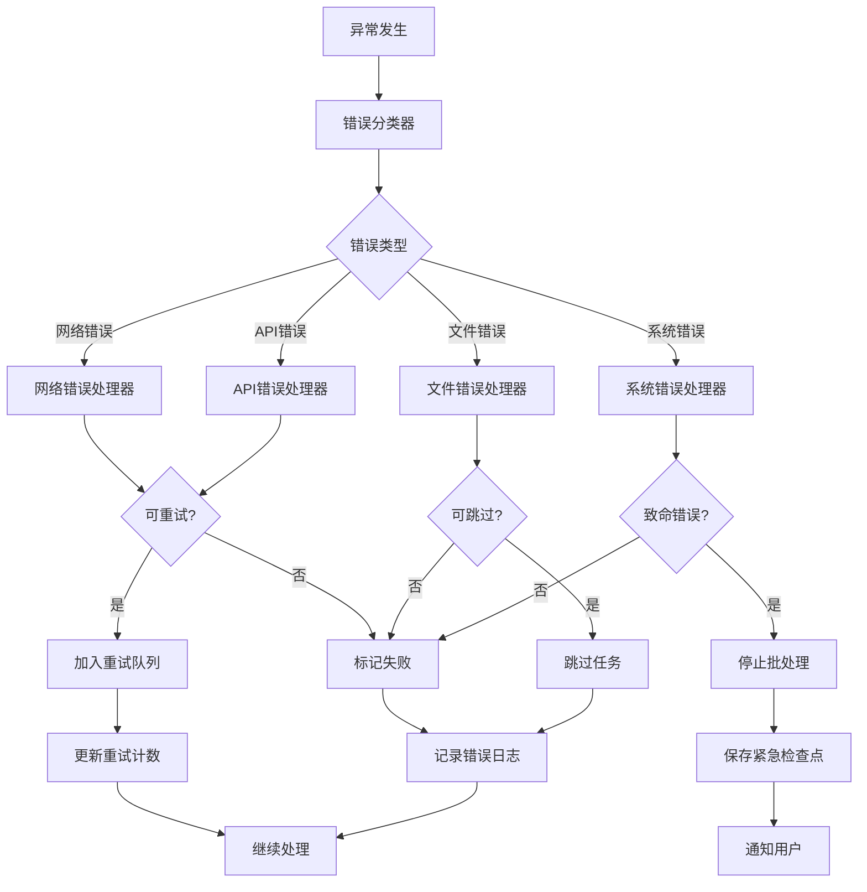
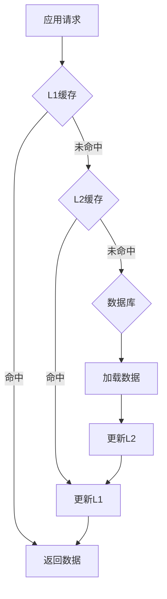

# 批量处理功能 - 数据流设计

## 概述

本文档详细描述批量处理功能的数据流架构，包括数据流转过程、状态变迁、存储设计和同步机制。

## 总体数据流架构

### 高层数据流图



### 数据流阶段

#### 1. 输入处理阶段 (Input Processing)
- **输入**: 用户指定的输入源 (目录/文件列表/URL列表)
- **处理**: 解析、验证、规范化
- **输出**: 标准化的VideoInput对象列表

#### 2. 任务生成阶段 (Task Generation)
- **输入**: VideoInput对象列表
- **处理**: 创建VideoTask对象，分配优先级
- **输出**: 待处理任务队列

#### 3. 并发执行阶段 (Concurrent Execution)
- **输入**: 任务队列中的VideoTask
- **处理**: 并发视频分析和格式化
- **输出**: TaskResult对象

#### 4. 结果聚合阶段 (Result Aggregation)
- **输入**: TaskResult对象流
- **处理**: 进度统计、状态更新、检查点保存
- **输出**: 实时进度和最终报告

#### 5. 输出生成阶段 (Output Generation)
- **输入**: 处理完成的结果
- **处理**: 文件写入、报告生成、通知发送
- **输出**: 最终的文件和报告

## 详细数据流设计

### 1. 输入处理数据流

#### 目录扫描流程


#### 文件信息数据结构
```python
@dataclass
class FileInfo:
    """文件基础信息"""
    file_path: str
    file_size: int
    file_format: str
    last_modified: datetime
    is_accessible: bool
    metadata: Dict[str, Any]

@dataclass
class VideoInput:
    """标准化视频输入"""
    source_type: InputType  # FILE, URL, YOUTUBE
    source_path: str
    template: str
    output_path: str
    estimated_duration: Optional[int]
    file_size: Optional[int]
    priority: int
    metadata: Dict[str, Any]
```

### 2. 任务队列数据流

#### 任务状态变迁图


#### 任务队列管理流程


### 3. 并发处理数据流

#### 工作线程处理流程


#### 数据传递接口
```python
class WorkerDataFlow:
    """工作线程数据流管理"""
    
    async def process_task(self, task: VideoTask) -> TaskResult:
        """处理单个任务的完整数据流"""
        
        # 1. 数据输入阶段
        input_data = await self._prepare_input_data(task)
        
        # 2. 处理执行阶段
        processing_result = await self._execute_processing(input_data)
        
        # 3. 结果输出阶段
        output_result = await self._generate_output(processing_result)
        
        # 4. 状态更新阶段
        await self._update_task_state(task, output_result)
        
        return output_result
    
    async def _prepare_input_data(self, task: VideoTask) -> ProcessingInput:
        """准备处理输入数据"""
        return ProcessingInput(
            video_path=task.input.source_path,
            template=await self.template_manager.load_template(task.input.template),
            config=self.config,
            metadata=task.input.metadata
        )
    
    async def _execute_processing(self, input_data: ProcessingInput) -> ProcessingResult:
        """执行核心处理逻辑"""
        # 重用现有处理组件
        analysis_result = await self.gemini_service.analyze_video(
            input_data.video_path, 
            input_data.template
        )
        
        formatted_content = await self.formatter.format_lesson(
            analysis_result.to_lesson_plan_data()
        )
        
        return ProcessingResult(
            content=formatted_content,
            metadata=analysis_result.metadata,
            processing_time=time.time() - input_data.start_time
        )
```

### 4. 状态管理数据流

#### 状态数据库设计
```sql
-- 批量任务表
CREATE TABLE batch_jobs (
    batch_id TEXT PRIMARY KEY,
    status TEXT NOT NULL,
    config_data TEXT NOT NULL,  -- JSON
    created_at TIMESTAMP NOT NULL,
    started_at TIMESTAMP,
    completed_at TIMESTAMP,
    total_tasks INTEGER,
    completed_tasks INTEGER,
    failed_tasks INTEGER,
    metadata TEXT  -- JSON
);

-- 任务表
CREATE TABLE tasks (
    task_id TEXT PRIMARY KEY,
    batch_id TEXT NOT NULL,
    status TEXT NOT NULL,
    input_data TEXT NOT NULL,  -- JSON
    created_at TIMESTAMP NOT NULL,
    started_at TIMESTAMP,
    completed_at TIMESTAMP,
    retry_count INTEGER DEFAULT 0,
    priority INTEGER DEFAULT 50,
    worker_id TEXT,
    error_message TEXT,
    result_data TEXT,  -- JSON
    FOREIGN KEY (batch_id) REFERENCES batch_jobs(batch_id)
);

-- 进度快照表
CREATE TABLE progress_snapshots (
    snapshot_id TEXT PRIMARY KEY,
    batch_id TEXT NOT NULL,
    timestamp TIMESTAMP NOT NULL,
    progress_data TEXT NOT NULL,  -- JSON
    FOREIGN KEY (batch_id) REFERENCES batch_jobs(batch_id)
);

-- 检查点表
CREATE TABLE checkpoints (
    checkpoint_id TEXT PRIMARY KEY,
    batch_id TEXT NOT NULL,
    timestamp TIMESTAMP NOT NULL,
    state_data TEXT NOT NULL,  -- JSON
    file_path TEXT,
    is_current BOOLEAN DEFAULT FALSE,
    FOREIGN KEY (batch_id) REFERENCES batch_jobs(batch_id)
);
```

#### 状态同步机制


### 5. 进度监控数据流

#### 实时进度计算
```python
class ProgressCalculator:
    """进度计算和预测"""
    
    def __init__(self):
        self.samples = deque(maxlen=100)  # 保留最近100个样本
        self.start_time = None
        
    def add_completion_sample(self, task_result: TaskResult) -> None:
        """添加完成任务样本"""
        sample = ProgressSample(
            timestamp=datetime.now(),
            processing_time=task_result.processing_time,
            file_size=task_result.metadata.get('file_size', 0),
            success=task_result.success
        )
        self.samples.append(sample)
    
    def calculate_eta(self, remaining_tasks: int) -> Optional[datetime]:
        """计算预计完成时间"""
        if len(self.samples) < 5:
            return None
            
        # 使用加权移动平均，最近的样本权重更高
        weights = [1.0 + i * 0.1 for i in range(len(self.samples))]
        weighted_times = [
            sample.processing_time * weight 
            for sample, weight in zip(self.samples, weights)
        ]
        
        avg_time = sum(weighted_times) / sum(weights)
        estimated_seconds = remaining_tasks * avg_time
        
        return datetime.now() + timedelta(seconds=estimated_seconds)
    
    def get_throughput_trend(self) -> ThroughputTrend:
        """获取吞吐量趋势"""
        if len(self.samples) < 10:
            return ThroughputTrend.STABLE
            
        recent_throughput = self._calculate_recent_throughput()
        historical_throughput = self._calculate_historical_throughput()
        
        ratio = recent_throughput / historical_throughput
        
        if ratio > 1.1:
            return ThroughputTrend.IMPROVING
        elif ratio < 0.9:
            return ThroughputTrend.DECLINING
        else:
            return ThroughputTrend.STABLE
```

#### 进度数据结构
```python
@dataclass
class ProgressSnapshot:
    """进度快照数据"""
    timestamp: datetime
    batch_id: str
    total_tasks: int
    completed_tasks: int
    failed_tasks: int
    running_tasks: int
    pending_tasks: int
    
    # 性能指标
    average_processing_time: float
    current_throughput: float  # 任务/分钟
    peak_memory_usage: float   # MB
    
    # 预测指标
    eta: Optional[datetime]
    estimated_remaining_time: int  # 秒
    confidence_level: float  # 0-1
    
    # 错误统计
    error_rate: float
    retry_rate: float
    
    def to_dict(self) -> Dict[str, Any]:
        """序列化为字典"""
        return asdict(self)
    
    @classmethod
    def from_dict(cls, data: Dict[str, Any]) -> 'ProgressSnapshot':
        """从字典反序列化"""
        return cls(**data)
```

### 6. 检查点数据流

#### 检查点保存策略


#### 检查点数据格式
```python
@dataclass
class CheckpointData:
    """检查点数据结构"""
    # 元数据
    version: str = "1.0"
    checkpoint_id: str = ""
    batch_id: str = ""
    timestamp: datetime = field(default_factory=datetime.now)
    
    # 批量状态
    batch_status: BatchStatus = BatchStatus.RUNNING
    batch_config: Dict[str, Any] = field(default_factory=dict)
    
    # 任务状态
    task_states: List[Dict[str, Any]] = field(default_factory=list)
    queue_state: Dict[str, Any] = field(default_factory=dict)
    
    # 进度信息
    progress_data: Dict[str, Any] = field(default_factory=dict)
    performance_stats: Dict[str, Any] = field(default_factory=dict)
    
    # 系统状态
    worker_states: List[Dict[str, Any]] = field(default_factory=list)
    resource_usage: Dict[str, Any] = field(default_factory=dict)
    
    def to_json(self) -> str:
        """序列化为JSON"""
        return json.dumps(asdict(self), default=str, indent=2)
    
    @classmethod
    def from_json(cls, json_str: str) -> 'CheckpointData':
        """从JSON反序列化"""
        data = json.loads(json_str)
        return cls(**data)
```

### 7. 错误处理数据流

#### 错误分类和路由


#### 错误恢复数据结构
```python
@dataclass
class ErrorContext:
    """错误上下文信息"""
    error_id: str
    task_id: str
    error_type: str
    error_message: str
    stack_trace: str
    timestamp: datetime
    retry_count: int
    
    # 错误发生时的状态
    task_state: Dict[str, Any]
    system_state: Dict[str, Any]
    
    # 恢复策略
    recovery_action: RecoveryAction
    retry_delay: float
    max_retries: int
    
@dataclass 
class RecoveryPlan:
    """恢复计划"""
    strategy: RecoveryStrategy
    actions: List[RecoveryAction]
    prerequisites: List[str]
    estimated_time: int
    success_probability: float
```

## 数据一致性保证

### 1. ACID属性保证

#### 原子性 (Atomicity)
- 检查点保存使用原子写入
- 任务状态更新使用事务
- 批量操作要么全部成功要么全部回滚

#### 一致性 (Consistency)
- 状态变迁必须遵循预定义规则
- 任务计数与实际队列状态一致
- 进度百分比计算准确

#### 隔离性 (Isolation)
- 并发任务状态更新使用锁机制
- 检查点保存不影响正常处理
- 进度查询不阻塞任务执行

#### 持久性 (Durability)
- 所有状态变更持久化到数据库
- 检查点文件定期同步到磁盘
- 关键状态变更立即刷盘

### 2. 并发控制机制

```python
class ConcurrencyController:
    """并发控制管理器"""
    
    def __init__(self):
        self._task_locks = {}
        self._global_lock = asyncio.RLock()
        self._state_semaphore = asyncio.Semaphore(1)
    
    async def with_task_lock(self, task_id: str):
        """任务级别锁"""
        if task_id not in self._task_locks:
            self._task_locks[task_id] = asyncio.Lock()
        
        return self._task_locks[task_id]
    
    async def with_state_lock(self):
        """状态更新锁"""
        return self._state_semaphore
    
    async def atomic_batch_update(self, updates: List[StateUpdate]):
        """原子批量状态更新"""
        async with self._global_lock:
            try:
                # 开始事务
                await self.state_manager.begin_transaction()
                
                for update in updates:
                    await self.state_manager.apply_update(update)
                
                # 提交事务
                await self.state_manager.commit_transaction()
                
            except Exception as e:
                # 回滚事务
                await self.state_manager.rollback_transaction()
                raise e
```

## 性能优化数据流

### 1. 数据缓存策略

#### 多层缓存架构


#### 缓存实现
```python
class DataFlowCache:
    """数据流缓存管理"""
    
    def __init__(self):
        self.l1_cache = LRUCache(maxsize=100)      # 内存缓存
        self.l2_cache = DiskCache(maxsize=1000)    # 磁盘缓存
        self.cache_stats = CacheStats()
    
    async def get_cached_data(self, key: str) -> Optional[Any]:
        """获取缓存数据"""
        # L1 缓存查找
        data = self.l1_cache.get(key)
        if data is not None:
            self.cache_stats.record_hit('l1')
            return data
        
        # L2 缓存查找  
        data = await self.l2_cache.get(key)
        if data is not None:
            self.cache_stats.record_hit('l2')
            self.l1_cache.set(key, data)
            return data
        
        self.cache_stats.record_miss()
        return None
    
    async def set_cached_data(self, key: str, data: Any) -> None:
        """设置缓存数据"""
        self.l1_cache.set(key, data)
        await self.l2_cache.set(key, data)
```

### 2. 数据压缩和序列化

#### 高效序列化
```python
class OptimizedSerializer:
    """优化的数据序列化器"""
    
    @staticmethod
    def serialize_task_state(task: VideoTask) -> bytes:
        """高效序列化任务状态"""
        # 使用msgpack进行紧凑序列化
        data = {
            'id': task.task_id,
            'status': task.status.value,
            'input': task.input.__dict__,
            'created': task.created_at.timestamp(),
            'started': task.started_at.timestamp() if task.started_at else None,
            'completed': task.completed_at.timestamp() if task.completed_at else None,
            'retry': task.retry_count,
            'meta': task.metadata
        }
        
        return msgpack.packb(data, use_bin_type=True)
    
    @staticmethod
    def deserialize_task_state(data: bytes) -> VideoTask:
        """反序列化任务状态"""
        obj = msgpack.unpackb(data, raw=False)
        
        return VideoTask(
            task_id=obj['id'],
            status=TaskStatus(obj['status']),
            input=VideoInput(**obj['input']),
            created_at=datetime.fromtimestamp(obj['created']),
            started_at=datetime.fromtimestamp(obj['started']) if obj['started'] else None,
            completed_at=datetime.fromtimestamp(obj['completed']) if obj['completed'] else None,
            retry_count=obj['retry'],
            metadata=obj['meta']
        )
```

## 监控和观测

### 1. 数据流监控指标

```python
@dataclass
class DataFlowMetrics:
    """数据流监控指标"""
    # 吞吐量指标
    tasks_per_second: float
    data_processed_mb_per_second: float
    api_calls_per_minute: float
    
    # 延迟指标
    avg_queue_wait_time: float
    avg_processing_time: float
    avg_io_time: float
    
    # 错误指标
    error_rate: float
    retry_rate: float
    timeout_rate: float
    
    # 资源使用指标
    memory_usage_mb: float
    cpu_usage_percent: float
    disk_io_mb_per_second: float
    network_io_mb_per_second: float
    
    # 队列状态指标
    queue_depth: int
    pending_tasks: int
    running_tasks: int
    
    def to_prometheus_format(self) -> str:
        """转换为Prometheus格式"""
        metrics = []
        for field_name, value in asdict(self).items():
            metric_name = f"gs_videoreport_batch_{field_name}"
            metrics.append(f"{metric_name} {value}")
        return '\n'.join(metrics)
```

### 2. 数据流追踪

```python
class DataFlowTracer:
    """数据流追踪器"""
    
    def __init__(self):
        self.traces = {}
        self.active_spans = {}
    
    def start_trace(self, trace_id: str, operation: str) -> TraceSpan:
        """开始追踪"""
        span = TraceSpan(
            trace_id=trace_id,
            span_id=self._generate_span_id(),
            operation=operation,
            start_time=time.time(),
            tags={}
        )
        
        self.active_spans[span.span_id] = span
        return span
    
    def finish_trace(self, span: TraceSpan, success: bool = True, error: str = None):
        """完成追踪"""
        span.end_time = time.time()
        span.duration = span.end_time - span.start_time
        span.success = success
        span.error = error
        
        if span.trace_id not in self.traces:
            self.traces[span.trace_id] = []
        
        self.traces[span.trace_id].append(span)
        del self.active_spans[span.span_id]
```

---

*文档版本: v1.0*  
*创建日期: 2025-08-18*  
*负责人: 架构师@qa.mdc*  
*状态: 数据流设计完成*
