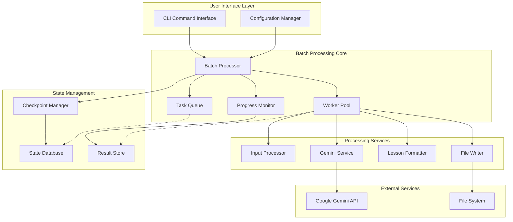

# 批量处理功能 - 架构概述

## 项目背景

gs_videoReport 需要扩展批量处理能力，以支持用户同时处理多个视频文件，提升工作效率。批量处理功能将在保持现有单视频处理能力基础上，添加并行处理、进度监控、错误恢复等企业级功能。

## 架构原则

### 1. 向后兼容性
- 保持现有CLI接口不变
- 现有配置和模板系统继续有效
- 单视频处理性能不受影响

### 2. 模块化设计
- 新功能作为独立模块添加
- 最大化重用现有组件
- 清晰的组件边界和职责

### 3. 可扩展性
- 支持不同输入源类型
- 支持插件化的处理策略
- 灵活的配置和扩展机制

### 4. 可靠性
- 完善的错误处理和恢复
- 检查点和状态持久化
- 优雅的降级处理

## 高层架构图



## 核心组件架构

### 1. Batch Processor (批量处理器)
**职责**: 批量处理的核心协调器
- 管理整个批量处理生命周期
- 协调各个子系统
- 处理用户交互和反馈

**接口设计**:
```python
class BatchProcessor:
    def __init__(self, config: Config, options: BatchOptions)
    async def process_batch(self, inputs: List[VideoInput]) -> BatchResult
    def pause_processing(self) -> None
    def resume_processing(self) -> None
    def cancel_processing(self) -> None
    def get_status(self) -> BatchStatus
```

### 2. Task Queue (任务队列)
**职责**: 任务队列管理和调度
- 维护待处理任务队列
- 支持任务优先级和依赖
- 提供任务状态查询

**接口设计**:
```python
class TaskQueue:
    def add_tasks(self, tasks: List[VideoTask]) -> None
    def get_next_task(self) -> Optional[VideoTask]
    def mark_completed(self, task_id: str, result: TaskResult) -> None
    def mark_failed(self, task_id: str, error: TaskError) -> None
    def get_queue_status(self) -> QueueStatus
```

### 3. Worker Pool (工作线程池)
**职责**: 并发任务执行管理
- 管理并发工作线程
- 控制API调用频率
- 处理资源限制

**接口设计**:
```python
class WorkerPool:
    def __init__(self, max_workers: int, api_limiter: APILimiter)
    async def start_workers(self) -> None
    async def stop_workers(self) -> None
    async def execute_task(self, task: VideoTask) -> TaskResult
    def get_worker_status(self) -> List[WorkerStatus]
```

### 4. Progress Monitor (进度监控)
**职责**: 实时进度跟踪和报告
- 监控批量处理进度
- 提供ETA估算
- 生成进度报告

**接口设计**:
```python
class ProgressMonitor:
    def start_monitoring(self, total_tasks: int) -> None
    def update_progress(self, event: ProgressEvent) -> None
    def get_current_progress(self) -> Progress
    def generate_report(self) -> ProgressReport
```

### 5. Checkpoint Manager (检查点管理)
**职责**: 状态持久化和恢复
- 定期保存处理状态
- 支持断点续传
- 清理历史状态

**接口设计**:
```python
class CheckpointManager:
    def save_checkpoint(self, state: BatchState) -> str
    def load_checkpoint(self, checkpoint_id: str) -> Optional[BatchState]
    def list_checkpoints(self) -> List[CheckpointInfo]
    def cleanup_old_checkpoints(self) -> None
```

## 数据模型设计

### 核心数据结构

#### VideoInput (视频输入)
```python
@dataclass
class VideoInput:
    input_type: InputType  # FILE, URL, YOUTUBE
    source_path: str       # 文件路径或URL
    template: str          # 处理模板
    output_path: str       # 输出路径
    metadata: Dict[str, Any]  # 额外元数据
```

#### VideoTask (视频任务)
```python
@dataclass
class VideoTask:
    task_id: str           # 唯一任务ID
    input: VideoInput      # 输入信息
    status: TaskStatus     # 任务状态
    created_at: datetime   # 创建时间
    started_at: Optional[datetime]  # 开始时间
    completed_at: Optional[datetime]  # 完成时间
    retry_count: int       # 重试次数
    error_message: Optional[str]  # 错误信息
    result: Optional[TaskResult]  # 处理结果
```

#### BatchState (批量状态)
```python
@dataclass
class BatchState:
    batch_id: str          # 批量任务ID
    total_tasks: int       # 总任务数
    completed_tasks: int   # 已完成任务数
    failed_tasks: int      # 失败任务数
    status: BatchStatus    # 批量状态
    started_at: datetime   # 开始时间
    config: BatchConfig    # 批量配置
    checkpoints: List[str] # 检查点列表
```

### 状态枚举

#### TaskStatus (任务状态)
```python
class TaskStatus(Enum):
    PENDING = "pending"         # 等待处理
    RUNNING = "running"         # 正在处理
    COMPLETED = "completed"     # 处理完成
    FAILED = "failed"           # 处理失败
    CANCELLED = "cancelled"     # 已取消
    RETRYING = "retrying"       # 重试中
```

#### BatchStatus (批量状态)
```python
class BatchStatus(Enum):
    INITIALIZING = "initializing"  # 初始化中
    RUNNING = "running"            # 运行中
    PAUSED = "paused"              # 已暂停
    COMPLETED = "completed"        # 全部完成
    FAILED = "failed"              # 批量失败
    CANCELLED = "cancelled"        # 已取消
```

## 关键设计决策

### 1. 并发模型选择
**决策**: 使用 asyncio + ThreadPoolExecutor 混合模型
**原因**:
- asyncio 适合I/O密集型操作 (API调用)
- ThreadPoolExecutor 适合CPU密集型操作 (视频处理)
- 现有代码兼容性良好

### 2. 状态存储方案
**决策**: SQLite + JSON 混合存储
**原因**:
- SQLite 提供结构化查询能力
- JSON 存储灵活的元数据
- 无需额外数据库依赖

### 3. API限流策略
**决策**: 令牌桶 + 自适应调整
**原因**:
- 令牌桶能平滑处理突发请求
- 自适应调整应对API限制变化
- 支持多种限制类型 (并发、频率、配额)

### 4. 错误处理策略
**决策**: 分层错误处理 + 智能重试
**原因**:
- 不同层级处理不同类型错误
- 根据错误类型智能重试
- 避免无效重试浪费资源

## 扩展点设计

### 1. 输入处理扩展
```python
class InputProcessor(ABC):
    @abstractmethod
    def parse_input(self, input_spec: str) -> List[VideoInput]:
        pass

# 支持的输入处理器
class DirectoryInputProcessor(InputProcessor): pass
class FileListInputProcessor(InputProcessor): pass
class CSVInputProcessor(InputProcessor): pass
class URLListInputProcessor(InputProcessor): pass
```

### 2. 输出格式扩展
```python
class OutputFormatter(ABC):
    @abstractmethod
    def format_result(self, result: TaskResult) -> str:
        pass

# 支持的输出格式化器
class MarkdownOutputFormatter(OutputFormatter): pass
class JSONOutputFormatter(OutputFormatter): pass
class HTMLOutputFormatter(OutputFormatter): pass
```

### 3. 通知系统扩展
```python
class NotificationHandler(ABC):
    @abstractmethod
    def send_notification(self, event: NotificationEvent) -> None:
        pass

# 支持的通知方式
class EmailNotificationHandler(NotificationHandler): pass
class WebhookNotificationHandler(NotificationHandler): pass
class SlackNotificationHandler(NotificationHandler): pass
```

## 性能设计目标

### 处理性能
- **并发处理**: 支持2-8个并发任务
- **吞吐量**: 35-70视频/小时 (取决于并发数)
- **内存使用**: 峰值 < 2GB (8并发场景)
- **启动时间**: < 5秒 (包含状态恢复)

### 可靠性指标
- **错误恢复率**: > 95% (网络错误自动重试)
- **数据一致性**: 100% (已完成任务结果保证正确)
- **检查点间隔**: 每完成10个任务或每5分钟
- **状态恢复时间**: < 30秒

### 用户体验
- **进度更新频率**: 每秒更新
- **ETA精确度**: ±20% (运行10分钟后)
- **操作响应时间**: < 1秒 (暂停/恢复操作)
- **错误信息可读性**: 95%用户能理解错误原因

## 安全考虑

### 1. API密钥保护
- 内存中加密存储
- 日志中自动脱敏
- 检查点文件加密

### 2. 文件系统安全
- 输出路径验证
- 防止路径遍历攻击
- 临时文件清理

### 3. 资源限制
- 磁盘空间检查
- 内存使用监控
- CPU使用限制

## 监控和日志

### 1. 关键指标监控
- 任务处理速度
- API调用成功率
- 内存和CPU使用
- 错误率统计

### 2. 日志策略
- 结构化日志输出
- 分级日志记录
- 敏感信息过滤
- 日志轮转管理

### 3. 调试支持
- 详细的任务执行轨迹
- 性能分析数据
- 错误堆栈信息
- 配置和环境信息

---

*文档版本: v1.0*  
*创建日期: 2025-08-18*  
*负责人: 架构师@qa.mdc*  
*审核状态: 待审核*
