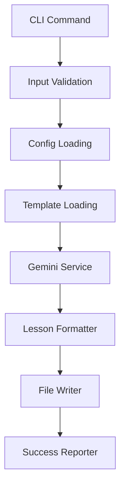

# 批量处理功能 - 技术可行性研究

## 概述

基于现有 gs_videoReport 架构，评估批量处理功能的技术可行性，识别扩展点和潜在挑战。

## 现有架构分析

### 当前组件结构
```
gs_video_report/
├── cli.py                  # CLI入口，单视频处理逻辑
├── main.py                 # 应用入口点
├── config.py               # 配置管理
├── template_manager.py     # 模板系统
├── lesson_formatter.py     # 结果格式化
├── file_writer.py          # 文件输出
├── services/
│   └── gemini_service.py   # Gemini API集成
└── templates/              # 模板文件
```

### 核心数据流分析


**单视频处理时间分析**:
- 配置加载: ~100ms
- 模板加载: ~50ms  
- 视频上传: 30s-300s (依据大小)
- AI分析: 60s-180s (依据长度)
- 格式化输出: ~500ms
- 文件写入: ~100ms

**总计**: 2-8分钟/视频

## 架构扩展评估

### 扩展性优势 ✅

#### 1. 模块化设计良好
- **独立服务**: GeminiService、LessonFormatter、FileWriter 都是独立类
- **配置解耦**: Config系统支持灵活配置
- **模板系统**: TemplateManager 已支持多模板切换
- **错误处理**: 现有组件有基础错误处理机制

#### 2. 组件接口清晰
```python
# 现有接口示例
class GeminiService:
    def analyze_video(self, video_path: str, template: str) -> GeminiAnalysisResult
    
class LessonFormatter:
    def format_lesson(self, data: LessonPlanData) -> str
    
class FileWriter:
    def write_lesson_plan(self, content: str, filename: str) -> FileWriterResult
```

#### 3. 状态管理基础
- `GeminiAnalysisResult` 包含元数据和时间戳
- `FileWriterResult` 提供操作结果反馈
- 结果对象支持序列化 (`to_dict()` 方法)

### 技术挑战分析 ⚠️

#### 1. 并发处理挑战

**API限制约束**:
```python
# Google Gemini API 限制
- 并发请求: 10个/用户
- 每分钟请求: 600个
- 单文件大小: 2GB
- 上下文长度: 2M tokens
```

**解决方案**:
- 实现请求池管理
- 动态并发调整
- 请求排队和限流

#### 2. 内存管理挑战

**内存使用分析**:
```python
# 单视频内存消耗估算
video_upload_buffer = 100MB  # 视频文件缓冲
api_response_data = 50MB     # API响应数据
template_processing = 20MB   # 模板处理
file_writing_buffer = 10MB   # 文件写入缓冲
# 总计: ~180MB/视频
```

**批量处理风险**:
- 8个并发 = 1.4GB 内存使用
- 需要优化内存使用模式

#### 3. 状态持久化挑战

**当前限制**:
- 无检查点机制
- 无进度持久化
- 无失败恢复策略

**需要添加**:
- 任务状态数据库
- 进度检查点
- 失败重试队列

## 扩展架构设计

### 新增核心组件

#### 1. BatchProcessor (批量处理器)
```python
class BatchProcessor:
    """批量处理核心引擎"""
    
    def __init__(self, config: Config, max_workers: int = 4):
        self.config = config
        self.max_workers = max_workers
        self.task_queue = TaskQueue()
        self.worker_pool = WorkerPool(max_workers)
        self.progress_monitor = ProgressMonitor()
        self.checkpoint_manager = CheckpointManager()
    
    async def process_batch(self, inputs: List[VideoInput]) -> BatchResult:
        """处理批量视频任务"""
        pass
```

#### 2. TaskQueue (任务队列)
```python
class VideoTask:
    """单个视频处理任务"""
    task_id: str
    input_path: str
    template: str
    output_path: str
    status: TaskStatus
    retry_count: int
    metadata: Dict[str, Any]

class TaskQueue:
    """任务队列管理器"""
    
    def add_task(self, task: VideoTask) -> None
    def get_next_task(self) -> Optional[VideoTask]
    def mark_completed(self, task_id: str, result: Any) -> None
    def mark_failed(self, task_id: str, error: Exception) -> None
    def get_progress(self) -> QueueProgress
```

#### 3. WorkerPool (工作线程池)
```python
class WorkerPool:
    """并发工作线程池"""
    
    def __init__(self, max_workers: int, api_limiter: APILimiter):
        self.max_workers = max_workers
        self.workers = []
        self.api_limiter = api_limiter
    
    async def execute_task(self, task: VideoTask) -> TaskResult:
        """执行单个任务"""
        # 重用现有 GeminiService, LessonFormatter, FileWriter
        pass
```

#### 4. ProgressMonitor (进度监控)
```python
class ProgressMonitor:
    """实时进度监控和报告"""
    
    def __init__(self):
        self.start_time = None
        self.completed_tasks = 0
        self.failed_tasks = 0
        self.total_tasks = 0
    
    def update_progress(self, completed: int, failed: int, total: int) -> None
    def get_eta(self) -> Optional[datetime]
    def generate_report(self) -> ProgressReport
```

#### 5. CheckpointManager (检查点管理)
```python
class CheckpointManager:
    """任务状态持久化和恢复"""
    
    def save_checkpoint(self, state: BatchState) -> None
    def load_checkpoint(self, checkpoint_file: str) -> Optional[BatchState]
    def cleanup_checkpoint(self, checkpoint_file: str) -> None
```

### 集成点分析

#### 1. CLI集成 (cli.py)
```python
# 新增批量处理命令
@app.command()
def batch(
    input_dir: Optional[str] = None,
    file_list: Optional[str] = None,
    template: str = "chinese_transcript",
    output_dir: str = "./output",
    parallel: int = 4,
    progress_file: Optional[str] = None,
    resume_from: Optional[str] = None,
    dry_run: bool = False
):
    """批量处理多个视频文件"""
    batch_processor = BatchProcessor(config, max_workers=parallel)
    # 处理逻辑
```

#### 2. 现有服务重用
```python
# 重用现有组件，最小化修改
class BatchGeminiService(GeminiService):
    """批量处理的Gemini服务扩展"""
    
    def __init__(self, config: Config, api_limiter: APILimiter):
        super().__init__(config)
        self.api_limiter = api_limiter
    
    async def analyze_video_batch(self, task: VideoTask) -> GeminiAnalysisResult:
        """带API限流的视频分析"""
        await self.api_limiter.acquire()
        try:
            return await super().analyze_video(task.input_path, task.template)
        finally:
            self.api_limiter.release()
```

## 技术风险评估

### 高风险 🔴

#### 1. API配额管理
**风险**: Google Gemini API的并发和配额限制
**影响**: 可能导致批量处理失败或性能下降
**缓解方案**:
- 实现智能限流算法
- 添加配额监控和预警
- 提供降级处理策略

#### 2. 大规模内存使用
**风险**: 处理大批量视频时内存溢出
**影响**: 系统崩溃，处理中断
**缓解方案**:
- 实现流式处理模式
- 添加内存使用监控
- 动态调整并发数

### 中风险 🟡

#### 3. 长时间运行稳定性
**风险**: 网络中断、系统重启等影响
**影响**: 批量任务失败，需要重头开始
**缓解方案**:
- 完善检查点机制
- 实现任务状态持久化
- 添加自动恢复功能

#### 4. 错误处理复杂性
**风险**: 批量处理中的错误分类和处理复杂
**影响**: 用户难以理解和处理错误
**缓解方案**:
- 建立错误分类体系
- 提供详细错误报告
- 实现智能重试策略

### 低风险 🟢

#### 5. 向后兼容性
**风险**: 新功能影响现有单视频处理
**影响**: 破坏现有用户工作流
**缓解方案**:
- 保持现有CLI接口不变
- 新增独立的batch命令
- 充分的回归测试

## 技术选型建议

### 并发处理框架
```python
# 推荐: asyncio + aiohttp
import asyncio
import aiohttp
from concurrent.futures import ThreadPoolExecutor

# 优势:
# - Python原生支持
# - 良好的异步I/O性能  
# - 与现有代码兼容性好
```

### 状态存储
```python
# 推荐: SQLite + JSON
import sqlite3
import json

# 优势:
# - 轻量级，无额外依赖
# - 支持结构化查询
# - 文件级别的持久化
```

### 进度监控
```python
# 推荐: Rich + 自定义进度条
from rich.progress import Progress, TaskID
from rich.live import Live

# 优势:
# - 与现有UI一致
# - 丰富的显示效果
# - 实时更新支持
```

## 性能预估

### 吞吐量分析
```python
# 基于当前性能数据
single_video_time = 4  # 分钟 (平均)
parallel_efficiency = 0.7  # 70%效率
api_overhead = 1.2  # 20%开销

# 预估吞吐量
parallel_4 = (4 * parallel_efficiency) / (single_video_time * api_overhead)
# ≈ 0.58 视频/分钟 ≈ 35 视频/小时

parallel_8 = (8 * parallel_efficiency) / (single_video_time * api_overhead)  
# ≈ 1.17 视频/分钟 ≈ 70 视频/小时
```

### 资源使用预估
```python
# 内存使用 (保守估算)
base_memory = 200  # MB (系统基础)
per_video_memory = 180  # MB (单视频处理)
parallel_overhead = 0.3  # 30%额外开销

memory_4_parallel = base_memory + (4 * per_video_memory * (1 + parallel_overhead))
# ≈ 1.14 GB

memory_8_parallel = base_memory + (8 * per_video_memory * (1 + parallel_overhead))
# ≈ 2.07 GB
```

## 实施可行性结论

### ✅ 可行性确认

1. **架构基础良好**: 现有模块化设计为批量扩展提供了良好基础
2. **技术方案成熟**: asyncio、sqlite等技术方案经过验证
3. **风险可控**: 主要风险都有明确的缓解方案
4. **性能可接受**: 预估性能能满足用户需求

### 📋 关键成功因素

1. **API限流机制**: 必须实现智能的API调用管理
2. **内存优化**: 需要优化内存使用模式
3. **错误处理**: 建立完善的错误分类和恢复机制
4. **渐进实施**: 分阶段实施，逐步验证和优化

### 🎯 实施建议

1. **MVP优先**: 先实现基础批量处理功能
2. **性能验证**: 在真实场景下验证性能预估
3. **用户反馈**: 早期用户测试收集反馈
4. **迭代优化**: 基于使用数据持续优化

---

*文档版本: v1.0*  
*创建日期: 2025-08-18*  
*负责人: 架构师@qa.mdc*
