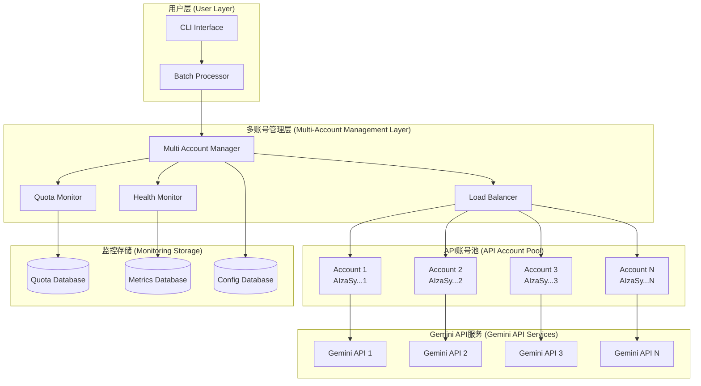

# 🔄 多API账号管理系统 - 技术设计文档

**版本**: v0.3.0 规划  
**创建日期**: 2025-08-19  
**负责角色**: @sm.mdc  
**优先级**: P0 (重点新增功能)

## 🎯 业务需求

### 问题背景
当前系统使用单一Google Gemini API账号，受到以下限制：
- **免费层配额**: 每账号100请求/天，6M tokens/天
- **并发限制**: 单账号并发处理能力有限
- **故障风险**: 单点故障，账号配额耗尽影响整个系统
- **效率瓶颈**: 大批量视频处理时效率受单账号配额限制

### 业务目标
通过多API账号管理系统，实现：
1. **突破配额限制**: 3-10个账号并行使用，扩展处理能力
2. **提高处理速度**: 3-5倍并发能力提升
3. **增强系统可靠性**: 自动故障切换，99.9%服务可用性
4. **优化成本效率**: 最大化免费配额利用率

## 🏗️ 系统架构设计

### 总体架构图



### 核心组件设计

#### 1. MultiAccountManager (多账号管理器)

```python
class MultiAccountManager:
    """多API账号管理核心引擎"""
    
    def __init__(self, config_path: str):
        self.config = self._load_config(config_path)
        self.account_pool = AccountPool(self.config.accounts)
        self.load_balancer = LoadBalancer(self.account_pool)
        self.quota_monitor = QuotaMonitor(self.account_pool)
        self.health_monitor = HealthMonitor(self.account_pool)
        
    async def get_api_client(self, request_context: RequestContext) -> GeminiClient:
        """智能选择最优API账号"""
        account = await self.load_balancer.select_account(request_context)
        return account.get_client()
        
    async def handle_api_failure(self, account: Account, error: Exception):
        """处理API调用失败"""
        await self.health_monitor.mark_failure(account, error)
        if self.health_monitor.should_isolate(account):
            await self.account_pool.isolate_account(account)
```

#### 2. LoadBalancer (负载均衡器)

```python
class LoadBalancer:
    """智能负载均衡调度器"""
    
    def __init__(self, account_pool: AccountPool):
        self.account_pool = account_pool
        self.strategies = {
            'weighted_round_robin': WeightedRoundRobinStrategy(),
            'least_quota_used': LeastQuotaUsedStrategy(),
            'fastest_response': FastestResponseStrategy(),
            'hybrid': HybridStrategy()  # 默认策略
        }
        
    async def select_account(self, context: RequestContext) -> Account:
        """基于多维度因素选择最优账号"""
        available_accounts = await self.account_pool.get_healthy_accounts()
        
        if not available_accounts:
            raise NoAvailableAccountException("所有账号都不可用")
            
        # 使用混合策略进行选择
        strategy = self.strategies['hybrid']
        selected = await strategy.select(available_accounts, context)
        
        # 记录选择决策
        await self._log_selection(selected, context)
        return selected
        
class HybridStrategy(SelectionStrategy):
    """混合选择策略 - 综合考虑配额、性能、负载"""
    
    async def select(self, accounts: List[Account], context: RequestContext) -> Account:
        scores = {}
        for account in accounts:
            score = await self._calculate_score(account, context)
            scores[account] = score
            
        return max(scores.items(), key=lambda x: x[1])[0]
        
    async def _calculate_score(self, account: Account, context: RequestContext) -> float:
        """计算账号综合得分"""
        # 配额因子 (40%)
        quota_factor = await self._get_quota_factor(account)
        
        # 性能因子 (30%)
        performance_factor = await self._get_performance_factor(account)
        
        # 负载因子 (20%)
        load_factor = await self._get_load_factor(account)
        
        # 可靠性因子 (10%)
        reliability_factor = await self._get_reliability_factor(account)
        
        return (quota_factor * 0.4 + 
                performance_factor * 0.3 + 
                load_factor * 0.2 + 
                reliability_factor * 0.1)
```

#### 3. QuotaMonitor (配额监控器)

```python
class QuotaMonitor:
    """实时配额监控和管理"""
    
    def __init__(self, account_pool: AccountPool):
        self.account_pool = account_pool
        self.quota_db = QuotaDatabase()
        self.alert_thresholds = {
            'warning': 0.8,   # 80%使用率警告
            'critical': 0.95  # 95%使用率紧急
        }
        
    async def track_api_usage(self, account: Account, request_type: str, tokens_used: int):
        """跟踪API使用情况"""
        usage_record = UsageRecord(
            account_id=account.id,
            timestamp=datetime.now(),
            request_type=request_type,
            tokens_used=tokens_used
        )
        
        await self.quota_db.record_usage(usage_record)
        
        # 检查配额状态
        current_usage = await self.quota_db.get_daily_usage(account)
        quota_ratio = current_usage / account.daily_limit
        
        if quota_ratio >= self.alert_thresholds['critical']:
            await self._handle_quota_critical(account, quota_ratio)
        elif quota_ratio >= self.alert_thresholds['warning']:
            await self._handle_quota_warning(account, quota_ratio)
            
    async def _handle_quota_critical(self, account: Account, ratio: float):
        """处理配额紧急情况"""
        # 标记账号为接近耗尽状态
        await self.account_pool.mark_quota_critical(account)
        
        # 发送告警
        await self._send_alert(f"账号 {account.name} 配额使用率达到 {ratio:.1%}")
        
        # 自动切换流量
        await self.account_pool.reduce_account_weight(account, factor=0.1)
```

#### 4. HealthMonitor (健康监控器)

```python
class HealthMonitor:
    """账号健康状态监控"""
    
    def __init__(self, account_pool: AccountPool):
        self.account_pool = account_pool
        self.metrics_db = MetricsDatabase()
        self.failure_thresholds = {
            'consecutive_failures': 3,    # 连续失败3次隔离
            'error_rate_window': 300,     # 5分钟窗口
            'max_error_rate': 0.5         # 最大错误率50%
        }
        
    async def record_api_call(self, account: Account, success: bool, 
                             response_time: float, error: Exception = None):
        """记录API调用结果"""
        metric = APICallMetric(
            account_id=account.id,
            timestamp=datetime.now(),
            success=success,
            response_time=response_time,
            error_type=type(error).__name__ if error else None,
            error_message=str(error) if error else None
        )
        
        await self.metrics_db.record_metric(metric)
        
        # 更新账号健康状态
        await self._update_health_status(account, metric)
        
    async def _update_health_status(self, account: Account, metric: APICallMetric):
        """更新账号健康状态"""
        # 检查连续失败
        if not metric.success:
            consecutive_failures = await self._get_consecutive_failures(account)
            if consecutive_failures >= self.failure_thresholds['consecutive_failures']:
                await self.account_pool.isolate_account(account, reason="连续失败过多")
                
        # 检查错误率
        recent_metrics = await self.metrics_db.get_recent_metrics(
            account, self.failure_thresholds['error_rate_window']
        )
        
        if recent_metrics:
            error_rate = sum(1 for m in recent_metrics if not m.success) / len(recent_metrics)
            if error_rate >= self.failure_thresholds['max_error_rate']:
                await self.account_pool.isolate_account(account, reason="错误率过高")
```

### 配置管理

#### 多账号配置格式

```yaml
# config.yaml - 多账号配置示例
api_accounts:
  strategy: "hybrid"  # weighted_round_robin | least_quota_used | fastest_response | hybrid
  
  accounts:
    - name: "主账号"
      api_key: "${GEMINI_API_KEY_1}"
      daily_limit: 100
      tokens_limit: 6000000
      weight: 1.0
      enabled: true
      
    - name: "备用账号1" 
      api_key: "${GEMINI_API_KEY_2}"
      daily_limit: 100
      tokens_limit: 6000000
      weight: 1.0
      enabled: true
      
    - name: "备用账号2"
      api_key: "${GEMINI_API_KEY_3}"
      daily_limit: 100
      tokens_limit: 6000000
      weight: 0.8  # 稍低权重
      enabled: true
      
  monitoring:
    quota_warning_threshold: 0.8
    quota_critical_threshold: 0.95
    health_check_interval: 60  # seconds
    failure_recovery_time: 1800  # 30 minutes
    
  load_balancing:
    max_retries: 3
    retry_delay: 5  # seconds
    circuit_breaker_threshold: 10
    circuit_breaker_timeout: 300  # 5 minutes
```

#### 安全配置

```yaml
security:
  api_key_encryption:
    enabled: true
    encryption_key: "${API_ENCRYPTION_KEY}"
    
  access_control:
    require_authentication: true
    rate_limiting:
      enabled: true
      max_requests_per_minute: 60
      
  audit_logging:
    enabled: true
    log_level: "INFO"
    retention_days: 30
```

## 🚀 实现计划

### Phase 1: 账号池管理器 (3天)

**Day 1**: 配置系统设计
- [ ] 多账号配置结构设计
- [ ] API密钥加密存储机制
- [ ] 配置验证和加载逻辑

**Day 2**: 账号状态管理
- [ ] 账号池初始化和管理
- [ ] 账号健康状态跟踪
- [ ] 账号隔离和恢复机制

**Day 3**: 持久化和监控基础
- [ ] 状态持久化数据库设计
- [ ] 基础监控指标定义
- [ ] 日志和审计系统

### Phase 2: 负载均衡调度器 (4天)

**Day 4-5**: 调度算法实现
- [ ] 加权轮询策略
- [ ] 最少配额使用策略
- [ ] 最快响应时间策略
- [ ] 混合调度策略

**Day 6-7**: 智能选择机制
- [ ] 多维度评分算法
- [ ] 自适应权重调整
- [ ] 预测性配额管理
- [ ] 性能监控和优化

### Phase 3: 并发处理协调器 (3天)

**Day 8**: 并发控制
- [ ] 跨账号Worker池管理
- [ ] 任务分发和负载均衡
- [ ] 并发限制和流控

**Day 9**: 监控Dashboard
- [ ] 实时监控界面
- [ ] 配额使用统计
- [ ] 性能指标展示
- [ ] 告警和通知系统

**Day 10**: 故障恢复
- [ ] 自动故障检测
- [ ] 智能重试机制
- [ ] 任务重分配策略
- [ ] 恢复时间优化

### Phase 4: 集成测试和优化 (1天)

**Day 11**: 端到端测试
- [ ] 多账号场景测试
- [ ] 故障切换测试
- [ ] 性能基准测试
- [ ] 文档完善

## 🎯 预期收益

### 性能提升
- **并发能力**: 3-5倍处理速度提升
- **吞吐量**: 支持300-500个视频/天处理能力
- **响应时间**: 平均响应时间减少30%

### 可靠性增强  
- **服务可用性**: 99.9%可用性保证
- **故障恢复**: 自动故障切换，平均恢复时间<30秒
- **配额利用**: 95%+的免费配额使用效率

### 用户体验改善
- **透明管理**: 用户无感知的多账号切换
- **实时监控**: 清晰的配额和性能监控
- **配置灵活**: 简单的YAML配置管理

## 🔧 技术风险和缓解方案

### 风险1: 配置复杂性增加
**缓解方案**: 
- 提供配置向导和验证工具
- 详细的配置文档和示例
- 自动化配置检测和修复

### 风险2: 账号管理成本
**缓解方案**:
- 智能化的账号创建指导
- 自动化的配额监控和告警
- 成本效益分析工具

### 风险3: 系统复杂性增加
**缓解方案**:
- 模块化设计，逐步迁移
- 完整的单元测试和集成测试
- 详细的故障排除文档

## 📚 相关文档

- [next_phase_plan.md](../planning/next_phase_plan.md) - 总体开发计划
- [batch_processing/](./batch_processing/) - 批量处理架构文档
- [5-核心工作流-core-workflow.md](./5-核心工作流-core-workflow.md) - 核心流程设计

---

**创建者**: @po.mdc  
**审批者**: @sm.mdc  
**最后更新**: 2025-08-19

*此文档将在项目重启时作为多API账号管理系统开发的主要参考*
